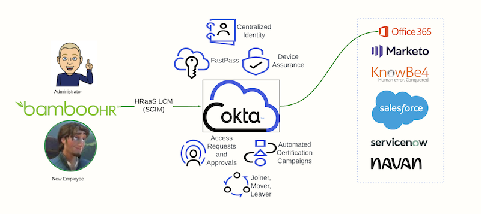

# Okta **WIC-Labs**

*Lab guide version: 0.10.24.01*

In this workshop, you will experience the power of the Workforce Identity Cloud as you leverage capabilities across the platform to solve common identity challenges facing organizations today.

Begin with mastering the art of efficiently onboarding new team members, followed by a deep dive into seamlessly integrating Office 365 to optimize workplace tools.

Discover the future with our session on bolstering security through a passwordless experience.

Navigate the intricate pathways of application access, from requests to approvals to access certifications. Gain expertise in overseeing employee transitions with ease as they move within and out of the organization.

You will wrap up your learning journey with a comprehensive understanding of the essentials in audits and reporting, ensuring both insights and oversight.
