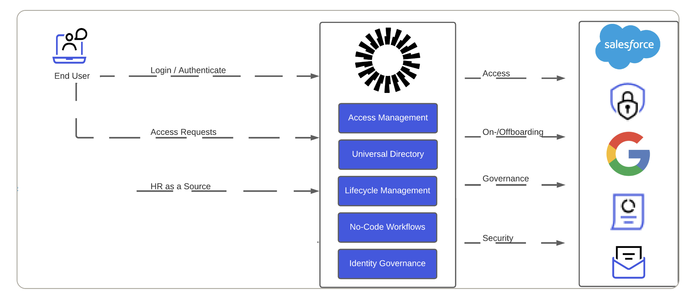

# Okta **WIC-Labs**

(Version **0.10.11.pod**)

In this Workshop, you will learn how to integrate Okta with different identity directories and applications.

Okta provides Single Sign-On with adaptive MFA and advanced user life-cycle management and workflows to provide a secure and seamless experience for administrators as well as end-users.

The goal of the workshop is to build and end-to-end demo environment from integrating applications for Single Sign-On and creating a seamless and enriched onboarding journey for new employees

Additionally we have prepared some optional advanced use cases.
