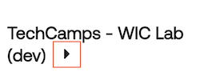

## Welcome

*Lab guide version: 0.11.08.01*

Step into the Future of Workforce Identity Management with Okta!

Imagine being entrusted with your organization’s Workforce Identity Management. Your mission, should you choose to accept it:

1. Cut Down on IAM Costs
2. Boost Security with Zero Trust principles
3. Enhance Visibility into employee access patterns and act on them.

And... all the while ensuring an incredible user experience that amplifies productivity. Sounds intense, doesn’t it?

Here’s the Twist: With the unparalleled capabilities of Okta’s Workforce Identity Cloud, it's more than possible. And we're here to guide you every step of the way!

## Initial sign in to your Okta tenant

As part of the provisioning process for your Okta Workforce Identity Cloud tenant, an Okta admin account was created that corresponds to your email address that you used to sign in to labs.demo.okta.com.

1. Check your inbox for an email with the subject line **Your New Okta account**.
1. Copy the **Temporary password**, and then click **Sign On**.
1. Follow the instructions on the screen to sign in to your Okta tenant. After a successful sign in, you will see the **Okta End-User Dashboard**.
1. Sign out of your Okta tenant and close the browser tab.
   **Be sure to remember your new Okta admin account password**.

## Launch your Virtual Desktop

The Virtual Desktop image that we’re using for this lab is also used by Okta Education for their training classes.  We created a PowerShell script that will cleanup the desktop and provide you with some helpful shortcuts that are specific to this lab.

1. In the  **Launch Pad** on the right, under **Virtual Desktop**, click **Launch**. This will open a new browser tab.

   |||
      |:-----|:-----|
      || |
1. Click **Launch Virtual Infrastructure**. It may take up to five minutes for your Virtual Desktop to start.

1. Copy the following PowerShell code block.
```$labName="{{idp.name}}"; (iwr https://cdn.demo.okta.com/labs/techcamps_wic/labvm/config.ps1 | iex)```

1. In the Virtual Desktop, open the PowerShell application.

   |||
   |:-----|:-----|
   || **Hint:** Look for this PowerShell app icon in the virtual desktop's toolbar. |
1. Paste and run the PowerShell script.
1. Verify that your virtual desktop now has shortcuts to Chrome, the Downloads folder, and Notepad. You will also have an open browser window set to your Okta tenant's sign in page.

## An Overview of your Lab Environment

Before we get started, here are your resources for today’s mission:

### TechCamps Outline

Where's my GPS? On the left, you’ll find an outline of today’s mission which also serves as your control panel. This TechCamps - Workforce Identity Cloud consists of seven sections, each with its own subsections. As you progress through the sections, the subsections will display. You also have the ability to collapse the outline by clicking on the arrow icon.

   |||
   |:-----|:-----|
   || |

At the bottom of each section, there's a handy control to navigate forwards and backwards between the sections.

   |||
   |:-----|:-----|
   || |

### Launch Pad

Peek into the fashionably gray box on your right, and you'll discover an easy way to launch your lab resources.  Each resource has it's own launch button along with the tenant names and credentials where applicable. You can collapse and expand the control with the arrow icon and you can reveal the tenant credentials with the key icon.

   |Show/Hide|Credentials|
   |:-----|:-----|
   |||| "Credentials"|

### Dynamic Lab Guide Variables

In addition to the ability to copy credentials from the Launch Pad, we've also produced this lab guide using dynamic variables. These variables will display values specific to your lab environment. For example: `{{Office365.TenantID}}`.

Simply copy and paste them as needed.

### Okta Workforce Identity Cloud Tenant


Aren’t you lucky? Your own dedicated Okta tenant designed to tackle your organization's identity challenges!

Your registration email address is the Okta admin account, and your Okta tenant will be available for seven days in case you want to continue to explore its features and capabilities.

### Virtual Desktop


The virtual environment is where today's real workshop challenges await.

### HR Application (BambooHR)


 What's a Workforce identity mission without a genuine HR application for employee sourcing?

 In this lab, all participants are sharing a single instance of BambooHR. In the next section, you'll be asked to create a new employee, so make it unique so as not to cause any confusion.

### Microsoft Office 365


Your employees need seamless and secure access to their primary collaboration tool in order to be productive and stay connected.

In this lab, each participant gets their own Office 365 tenant that is pre-configured with a domain name.
