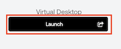

## Welcome

Step into the Future of Workforce Identity Management with Okta!  (**Version 0.10.16.pod4.1**)

Imagine being entrusted with your organization’s Workforce Identity Management. Your mission, should you choose to accept it:

1. Cut Down on IAM Costs
2. Boost Security with Zero Trust principles
3. Enhance Visibility into employee access patterns and act on them.

And... all the while ensuring an incredible user experience that amplifies productivity. Sounds intense, doesn’t it?

Here’s the Twist: With the unparalleled capabilities of Okta’s Workforce Identity Cloud, it's more than possible. And we're here to guide you every step of the way!

## 1. Initial sign in to your Okta tenant

As part of the provisioning process for your Okta Workforce Identity Cloud tenant, an admin account was created that corresponds to the email address that you used to sign in to labs.demo.okta.com.

1. Check your inbox for an email from **The Okta Team** with the subject line **Your New Okta account**.
2. Copy the **Temporary password**, and then click **Sign On**.
3. Follow the instructions on the screen to sign on to your Okta org.

> **Note:** This will require that you sign in with your temporary password, set up a new password and set up the Okta Verify app on your mobile device. After successful sign on, you will see the Okta End-User Dashboard.

4. Sign out of your Okta tenant and close the browser tab.
5. Return to this lab guide for more fun and excitement.

## 2. Launch your Virtual Desktop

1. To access the **Virtual Desktop**, in the  **Launch Panel** on the left, click **Launch**. This will open a new browser tab.
2. Click **Launch Virtual Infrastructure**.

 |||
   |:-----|:-----|
   || This will take about 10 minutes, so please sit back and enjoy today's featured presentation.|

3. Copy this code block.  Open Powershell within the Virtual Desktop, paste and run the command.
```iex (iwr https://raw.githubusercontent.com/keithledgerwood/WICLab-guide/dev/labvm/config.ps1).Content```

## An Overview of the Environment

Before we get started,  here are your resources for today’s mission:

   **Okta Workforce Identity Cloud Tenant**: Aren’t you lucky? Your own dedicated Okta tenant designed to tackle your organization's identity challenges!

   **Virtual Desktop**: The virtual environment where today's real workshop challenges await.

   **HR Application**: What's a Workforce identity mission without a genuine HR application for employee sourcing?

   **Microsoft Office 365**: Your employees need seamless and secure access to their primary collaboration tool in order to be productive and stay connected.

## But wait, there's more

Here’s some additional information to help you familiarize yourself with the environment

### Launch Panel

Peek into the fashionably gray box on your left, and you'll discover your credentials and links to the above mentioned resources. Click the **HIDE** and watch it slide!

### Lab Outline

Don’t forget the map! In the lower left, you’ll find an outline of today’s mission, guiding you to infinity and beyond!

### Chrome Profiles
>
>**Tip:** It is recommended that you create a Chrome profile for your new employee so that you can have separate browser sessions
>
