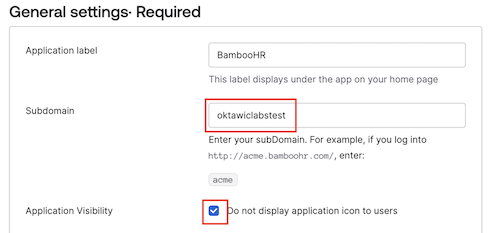
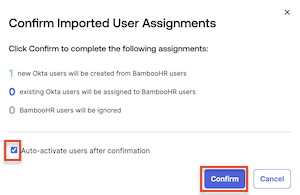

In this lab, we’ll explore the seamless integration of Okta with your HR system. Envision a world where new team members are onboarded with immediate, role-specific access, eliminating waiting times and ensuring productivity from day one. Our goal is to transform the onboarding process, making it both efficient, streamlined, and secure. Let’s get started on this journey to revolutionize the onboarding experience.

## Add a New Employee to BambooHR

|||
   |:-----|:-----|
   || |

When adding a new employee to BambooHR, we ask that you use a unique name, such as a  **favorite relative or friend, real or imaginary**.

1. To access the **BambooHR** dashboard, in your lab  **Launch Panel**, click **Launch**.
1. Sign in to **BambooHR** with the username and password provided in the **Launch Panel**
1. If prompted with **Should we always trust this browser?**, click **Yes, Trust this Browser**.
1. In the BambooHR dashboard, select **People**, and then click **New Employee**.
1. If prompted with **Heads Up!**, click **Add Anyway**.

1. Set the following attributes for your **New Employee**. All other attributes are optional.

   |Attribute|Value| For Example|
   |:-----|:-----|:----|
   |First Name |Enter a first name|*Flynn*|
   |Last Name | Enter a last name|*Rider*|
   |Work Email |firstName.lastName@ {{Office365.DomainName}}|*<flynn.rider@09.mywiclab.com>*|
   |Hire Date |*Today's Date*|*Today's Date*|
   |Job Title | **Director of Marketing**|*Director of Marketing*|
   |Department | **Marketing**|*Marketing*|

1. Click **Save**.

## Add the BambooHR App to Okta

Okta maintains a specific integration for BambooHR in the Okta Integration Network (OIN), that supports Okta SSO using SAML, and Provisioning using APIs.  In this section of the lab our focus will be on sourcing users from BambooHR using Okta Import.

1. To access your **Workforce Identity Cloud**, in the **Launch Panel**, click **Launch**.
1. In the Admin Console select **Applications** > **Applications**.
2. Click **Browse App Catalog**.

   

3. In the Browse App Integration Catalog **Search...** bar, type *bamboohr*  , and then click **BambooHR**.

   

4. Click **Add Integration**
5. In the **General Settings** set **Subdomain** to `{{BambooHR.Subdomain}}`.
6. For **Application Visibility**, select **Do not display application icon to to users.**

   |||
     |:-----|:-----|
     |||

7. Click **Next** to view the **Sign-On Options**.
8. Click **Done** to accept the defaults.

### Enable Provisioning via API Integration

In this section you will enable inbound provisioning from BambooHR to Okta.

1. Select the **Provisioning** tab.
1. Click **Configure API Integration**.
1. Select **Enable API integration**.
1. Click **Authenticate with BambooHR**.

   |||
      |:-----|:-----|
    |||

   > **Note:** If you don't have an active BambooHR session, you will be prompted to sign in using the BambooHR username and password from the lab **Launch Panel**.

5. After the success message appears, click **Save**.

   |||
      |:-----|:-----|
    |||

### Configure BambooHR to Okta Provisioning options

1. In the **Settings** panel, select **To Okta**
1. In the **General** section, click **Edit** to define import settings.
3. For **Okta username format**, select **Email Address**.
4. Click **Save**.

   |||
      |:-----|:-----|
    |||

5. Scroll to  the **Profile & Lifecycle Sourcing** section, and then click **Edit**
6. Select **Allow BambooHR to source Okta users**.
7. Click **Save**.

    |||
      |:-----|:-----|
   |||

## Import New Employee from BambooHR to Okta

1. Select the **Import** tab, and then click **Import Now**.
1. When the import and scan of users and groups is complete, click **OK**.
2. Use **Search** to find the new employee that you added into Bamboo HR.
3. Select the new employee via the checkbox on the right.
4. Click **Confirm Assignments**. This will open a confirmation dialog.
   |||
      |:-----|:-----|
   |||

5. Select **Auto-activate users after confirmation**. This will send out an activation email for the new employee's Okta account.
6. Click **Confirm**.

   |||
      |:-----|:-----|
   |||

   |||
   |:-----|:-----|
   ||*Did you know that Okta's HR integrations allow on-demand and scheduled imports, as well as instant access termination when needed? Isn’t that efficient!*|

### Verify New Employee Import

1. In the Admin Console select  **Directory** > **People** to verify that your new employee was successfully imported with a status of *Pending user action*.
2. Select the new employee to view their **Assigned Applications:** *Marketo*, *ServiceNow*, *Okta Access Requests*, and *BambooHR*.
3. Select the **Groups** tab to view their group memberships of *Everyone*, *Marketing*, and *Digital Marketing*.
4. Select the **Profile** tab to view their imported attributes.

## Retrieve New Employee Activation Email

 To access the new employee activation email, within the Virtual Desktop, you'll need to sign into your Office 365 tenant using the credentials provided in the launch panel.

1. In the **Virtual Desktop**, launch **Office 365** using the browser shortcut on the desktop
1. Sign in with your Office 365 Credentials.

   |||
    |:-----|:-----|
    |**Username**|`{{Office365.credentials.username}}`|
    |**Password**|`{{Office365.credentials.password}}`|

1. If prompted to **Stay signed in?**, select **Don't show this again** and click **Yes**.
1. Click the **Microsoft 365 app launcher** icon, and then click **Outlook**.

   |||
   |:-----|:-----|
   |||

4. Locate and open the New Employee's **Welcome to Okta!** email.
5. Click **Activate Okta Account**.

   >This will open a new browser window where you, as the Okta admin, will setup the new employee's Okta account.
6. Set up a new **password** according to the password policy rules displayed.
7. For Okta Verify, click **Set up later**.
7. The Okta End-user dashboard will display with the apps that were assigned to the new employee, with the exception of *BambooHR*.
   >**Question:**  *Why is BambooHR not displayed to the user?*
8. Sign out the New Employee and close the browser tab.
9. Sign out from Office 365 and close the browser.

## Conclusion

In this lab, we've journeyed together into the world of seamless onboarding with Okta and your HR system. Gone are the days of tedious waiting times for access. Instead, imagine a future where every new employee jumps straight into action from day one with role-specific access.
