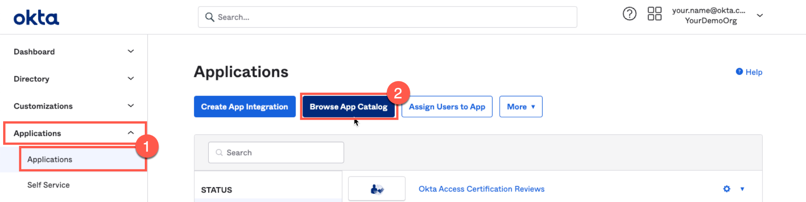
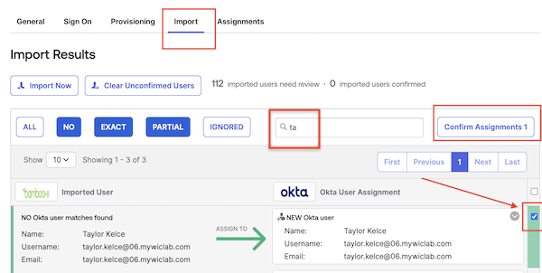

In this lab, we’ll explore the seamless integration of Okta with your HR system. Envision a world where new team members are onboarded with immediate, role-specific access, eliminating waiting times and ensuring productivity from day one. Our goal is to transform the onboarding process, making it both efficient, streamlined, and secure. Let’s get started on this journey to revolutionize the onboarding experience.

## Add New Employee to BambooHR

 

When adding a new employee to BambooHR, we ask that you use a unique name, such as a  favorite relative or friend, real or imaginary.

1. In the **Launch Pad** under **BambooHR**, click **Launch**. This will open the BambooHR login screen.
1. Enter your BambooHR Credentials.

   |BambooHR Credentials||
    |:-----|:-----|
    |**Username:**|`{{BambooHR.credentials.username}}`|
    |**Password:**|`{{BambooHR.credentials.password}}`|

1. Click **Log In**.
1. If prompted with **Should we always trust this browser?**, click **Yes, Trust this Browser**.
1. In the BambooHR dashboard, select **People**, and then click **New Employee**.

   |||
     |:-----|:-----|
   |||

1. If prompted with **Heads Up!**, click **Add Anyway**.

1. Set the following attributes for your **New Employee**.  No other attributes are required.

 **Note:** For this lab, the values in **bold** font must be used as shown. For example, your new employees' email domain must be **{{Office365.DomainName}}**.

   |Attribute|Value|
   |:-----|:-----|
   |First Name |*Enter a first name*|
   |Last Name | *Enter a last name*|
   |Work Email |*firstName*.*lastName*@**`{{Office365.DomainName}}`**|
   |Hire Date |*Today's Date*|*Today's Date*|
   |Job Title | **Director of Marketing**|
   |Department | **Marketing**|

1. Click **Save**.

## Add BambooHR App to Okta

 

Okta maintains a specific integration for BambooHR in the Okta Integration Network (OIN), that supports Okta SSO using SAML, and Provisioning using APIs.  In this section our focus will be on sourcing users from BambooHR using Okta Import. Specifically, we want to import the new employee into Okta.

1. In the **Launch Pad** under **Workforce Identity Cloud**, click **Launch**.
1. Sign in with your Okta admin account to access the Admin Console.
1. In the Admin Console select **Applications** > **Applications**.
2. Click **Browse App Catalog**.

   

3. In the Browse App Integration Catalog **Search...** bar, type *bamboohr* , and then click **BambooHR**.

   

4. Click **Add Integration**
5. In the **General Settings** set **Subdomain** to `{{BambooHR.Subdomain}}`.
6. For **Application Visibility**, select **Do not display application icon to users.**

   |||
     |:-----|:-----|
     |||

7. Click **Next** to view the **Sign-On Options**.
8. Click **Done** to accept the defaults.

### Enable Provisioning via API Integration

In this section you will enable inbound provisioning from BambooHR to Okta.

1. Select the **Provisioning** tab.
1. Click **Configure API Integration**.
1. Select **Enable API integration**.
1. Click **Authenticate with BambooHR**.

   |||
      |:-----|:-----|
    |||

   > **Note:** If you don't have an active BambooHR session, you will be prompted to sign in using the BambooHR username and password from the lab **Launch Pad**.

5. After the success message appears, click **Save**.

   |||
      |:-----|:-----|
    |||

### Configure BambooHR to Okta Provisioning options

1. In the **Settings** panel, select **To Okta**
1. In the **General** section, click **Edit**.
3. Set **Okta username format** to **Email Address**.
4. Click **Save**.

   |||
      |:-----|:-----|
    |||

5. Scroll to  the **Profile & Lifecycle Sourcing** section, and then click **Edit**
6. Select **Allow BambooHR to source Okta users**.
7. Click **Save**.

    |||
      |:-----|:-----|
   |||

## Import New Employee from BambooHR to Okta

 

1. Select the **Import** tab, and then click **Import Now**.
1. When the import and scan of users and groups is complete, click **OK**.
2. Use **Search** to find the new employee that you added into Bamboo HR.
3. Select the new employee via the checkbox on the right.
4. Click **Confirm Assignments**. This will open a confirmation dialog.
   |||
      |:-----|:-----|
   |||

5. Select **Auto-activate users after confirmation**. This will send out an activation email for the new employee's Okta account.
6. Click **Confirm**.

   |||
      |:-----|:-----|
   |||

   |||
   |:-----|:-----|
   ||*Did you know that Okta's HR integrations allow on-demand and scheduled imports, as well as instant access termination when needed? Isn’t that efficient!*|

### Verify New Employee Import

1. In the Admin Console select  **Directory** > **People** to verify that your new employee was successfully imported with a status of *Pending user action*.
2. Select the new employee to view their **Assigned Applications:** *Marketo*, *ServiceNow*, *Okta Access Requests*, and *BambooHR*.
3. Select the **Groups** tab to view their group memberships of *Everyone*, *Marketing*, and *Digital Marketing*.
4. Select the **Profile** tab to view their imported attributes.

## Retrieve New Employee Activation Email

  

 Your new employee's Okta activation email was sent to an Office 365 Administrator account. In this section of the lab, you'll return to your Virtual Desktop, sign into Office 365 and activate the new employee's Okta account on their behalf.

1. Return to your **Virtual Desktop** and launch **Chrome**.
1. Click the **Login | Microsoft 365** shortcut in the browser toolbar.
1. Sign in with your Office 365 Credentials.

   |Office 365 Credentials||
    |:-----|:-----|
    |**Username:**|`{{Office365.credentials.username}}`|
    |**Password:**|`{{Office365.credentials.password}}`|

1. Click the **Microsoft 365 app launcher** icon, and then click **Outlook**.

   |||
   |:-----|:-----|
   |||

1. Locate and open the New Employee's **Welcome to Okta!** email.
1. Click **Activate Okta Account**.
1. Set up a new **password** according to the password policy rules displayed.
   **Be sure to remember your new employee's password**.
1. For Okta Verify, click **Set up later**.
1. The Okta End-user dashboard will display the apps that were assigned to the new employee, with the exception of *BambooHR*.
1. Sign out the New Employee and close the browser tab.
1. Sign out from Office 365 and close the browser.

## Conclusion

In this lab, we've journeyed together into the world of seamless onboarding with Okta and your HR system. Gone are the days of tedious waiting times for access. Instead, imagine a future where every new employee jumps straight into action from day one with role-specific access.
