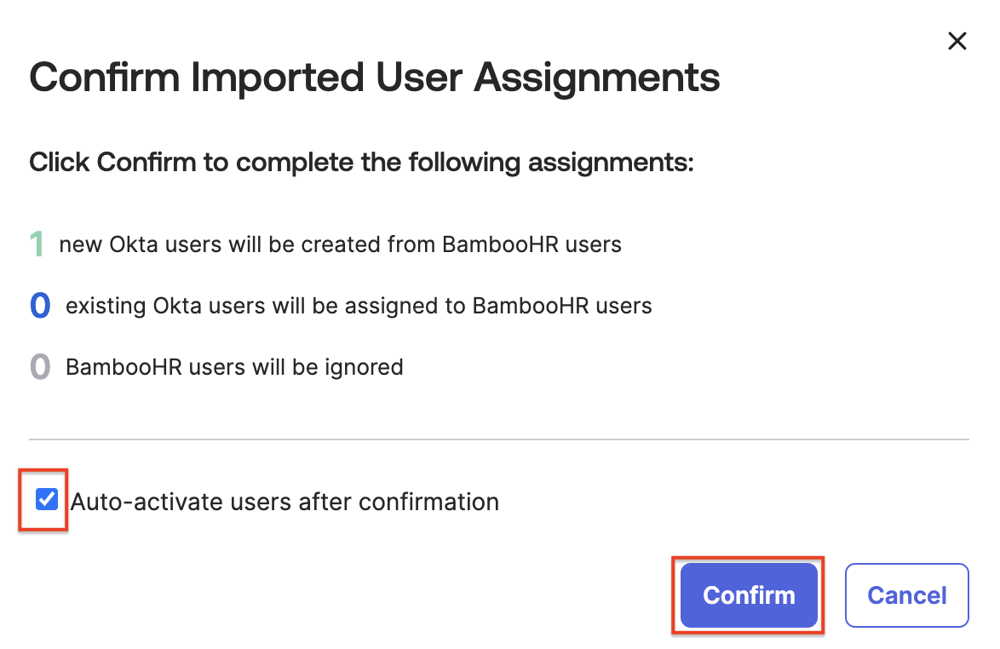

## Introduction

In this lab, we’ll explore the seamless integration of Okta with your HR system. Envision a world where new team members are onboarded with immediate, role-specific access, eliminating waiting times and ensuring productivity from day one. Our goal is to transform the onboarding process, making it both efficient, streamlined, and secure. Let’s get started on this journey to revolutionize the onboarding experience.

## Add a New Employee to BambooHR

When adding a new employee to BambooHR, we ask that you use a unique name, such as a  **favorite relative or friend, real or imaginary**.

1. To access the **BambooHR** dashboard, in your lab  **Launch Panel**, click **Launch**.
1. Sign in to **BambooHR** with the username and password provided in the **Launch Panel**
1. If prompted with **Should we always trust this browser?**, click the appropriate button.
1. In the BambooHR dashboard select **People**, and then click **New Employee**.
1. If prompted with **Heads Up!**, click **Add Anyway**.

   |Important step:|Example|
   |:-----|:-----|
   |
    For the New Employee's work email address, **the email domain needs to match your unique Office 365 domain name** in the lab launch panel.||

2. Check your **Office 365 Domain Name** in the launch panel; you will need this value for the new employee's email address.
2. Enter the following information to add a **New Employee**.

   |Attribute|Value|Example|
   |:-----|:-----|:----|
   |First Name |Enter a first name|*Flynn*|
   |Last Name | Enter a last name|*Rider*|
   |Work Email |firstName.lastName@\<your **Office 365 Domain Name**>|*<flynn.rider@04.mywiclab.com>*|
   |Hire Date |*Today*|*Today*|
   |Job Title | **Director of Marketing**|*Director of Marketing*|
   |Department | **Marketing**|*Marketing*|
   |Location | **Remote Worker**| *Remote Worker*|

5. Click **Save**.

## Add the BambooHR App to Okta

Okta maintains a specific integration for BambooHR in the Okta Integration Network (OIN), that supports Okta SSO using SAML, and Provisioning using APIs.  In this section of the lab our focus will be on sourcing users from BambooHR using Okta Import.

1. To access your **Workforce Identity Cloud** Admin Console, in the **Launch Panel**, click **Launch**.
1. In the Admin Console select **Applications** > **Applications**.
2. Click **Browse App Catalog**.

   

3. In the Browse App Integration Catalog **Search...** bar, type *bamboohr*  , and then click **BambooHR**.

   

4. Click **Add Integration**

   |Important step:|Example|
   |:-----|:-----|
   |
    The **BambooHR Subdomain** can be found in your lab **Launch Panel**.||

5. In the **General Settings** set **Subdomain** to your **BambooHR Subdomain** which can be found in the lab **Launch panel**.
6. For **Application Visibility**, select **Do not display application icon to to users.**

   
7. Click **Next** to view the **Sign-On Options**.
8. Click **Done** to accept the defaults.

### Enable Provisioning via API Integration

In this section you will enable inbound provisioning from BambooHR to Okta.  

1. Select the **Provisioning** tab.
1. Click **Configure API Integration**.
1. Select **Enable API integration**.
1. Click **Authenticate with BambooHR**.

   

   > **Note:** If you don't have an active BambooHR session, you will be prompted to sign in using the BambooHR username and password from the lab **Launch Panel**.

5. After the success message appears, click **Save**.

   

### Configure BambooHR to Okta Provisioning

1. In the **Settings** panel, select **To Okta**
1. In the **General** section, click **Edit** to define import settings.
3. For **Okta username format**, select **Email Address**.
4. Click **Save**.

   

5. Scroll to  the **Profile & Lifecycle Sourcing** section, and then click **Edit**
6. Select **Allow BambooHR to source Okta users**.
7. Click **Save**.

   

## Import New Employee from BambooHR to Okta

1. Select the **Import** tab, and then click **Import Now**.
1. When the import and scan of users and groups is complete, click **OK**.
2. Use **Search** to find the new employee that you added into Bamboo HR.
3. Select the new employee via the checkbox on the right.
4. Click **Confirm Assignments**. This will open a confirmation dialog.

   

5. Select **Auto-activate users after confirmation**. This will send out an activation email for the new employee's Okta account.
6. Click **Confirm**.

   

   |||
   |:-----|:-----|
   ||*Did you know that Okta's HR integrations allow on-demand and scheduled imports, as well as instant access termination when needed? Isn’t that efficient!.*|

### Verify New Employee Import

1. In the Admin Console select  **Directory** > **People** to verify that your new employee was successfully imported with a status of *Pending user action*.
2. Select the new employee to view their **Assigned Applications** of  **Marketo** and **BambooHR**.
3. Select the **Groups** tab to view their group memberships of **Everyone**, **Marketing** (from BambooHR), and **Digital Marketing**.
4. Select the **Profile** tab to view their imported attributes.

## Retrieve New Employee Activation Email

In order to access the new employee activation email, you'll need to sign into your Office 365 tenant as the labadmin.

1. To access the **Office 365** dashboard, in the  **Launch Panel**, click **Launch**.

2. Click **Login to Tenant** and sign in with your **labadmin** credentials from the lab **Launch Panel**.
3. Click the **Microsoft 365 app launcher** icon, and then click **Outlook**.

   

4. Locate and open the New Employee's *Welcome to Okta!* email.
5. Click **Activate Okta Account**.

   >This will open a new browser window where you, as the admin, will setup the new employees Okta account.
6. Set a **password** and set up **Okta Verify**.
7. The Okta End-user dashboard will display with the apps that were assigned to the new employee.
   >**Note:** The new employee was assigned to two applications **BambooHR** and **Marketo**.
   *Why is BambooHR not displayed to the user?*
8. Sign out the New Employee and close the browser tab.
9. Sign out from Office 365 and close the browser.

## Conclusion

Congrats! In just a few minutes, you made your HR system the authoritative source of Identities. You configured attribute mapping and created a transformation such that the username and email address would be a certain way upon the import.

Using these powerful features from Okta will allow you the flexibility to onboard users from multiple sources and create a single record containing only the attributes you want, from the sources that you want.

This is critical not just to keep your data clean and business secure, but to onboard other Lines of Business and possibly other companies in an M&A scenario.
