## Streamlining Workplace Productivity Tools

In this lab, we'll effortlessly integrate Okta with your Microsoft Office 365 environment. By leveraging the Okta Integration Network, you'll experience firsthand how modern application integrations can be both straightforward and rapid. Through the benefits of automated provisioning and single sign-on, employees will be poised for instant productivity. And even as we focus on a user-friendly experience, remember, security is always at the forefront.

## Add Microsoft Office 365 App to Okta for SSO

Okta maintains a specific integration for Microsoft Office 365 in the Okta Integration Network (OIN). To add this to your Okta tenant, follow these steps in a browser that does not currently have a Microsoft session:

1. In the Admin Console select **Applications** >  **Applications**.
1. Click **Browse App Catalog**.
1. In the Browse App Integration Catalog **Search...** bar, type *office 365* and then click **Microsoft Office 365**.
1. Click **Add integration**.

### General Settings

1. In the **General Settings** tab, set **Microsoft Tenant Name** to **{{Office365.TenantID}}**

    |||
   |:-----|:-----|
    |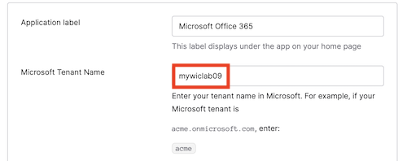|
1. Optional. For **Display the following links**, deselect all but: **Word, Excel, PowerPoint and Office Portal**.
1. Scroll down and click **Next**.

### Sign-On Options

1. In the **Sign On Options** tab, select **WS-Federation**.
    |||
   |:-----|:-----|
    |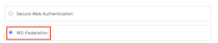|
1. Set the **Office 365 Admin Username** to `{{Office365.credentials.username}}`
1. Set the **Office 365 Admin password** to `{{Office365.credentials.password}}`
1. Click **Fetch and Select**. This will display a list of your Office 365 Domains.

    |||
   |:-----|:-----|
    |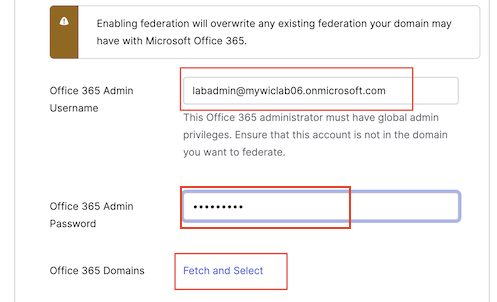|

10. For the **Domains** select **{{Office365.DomainName}}**.

    |||
    |:-----|:-----|
    |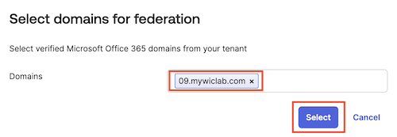|

### Customization with Okta Expression Language

1. In the **Credential Details** section, for **Application username format** select **Custom**.
1. For the **Custom** expression, copy and paste the following expression:

    ```javascript
    String.substringBefore(user.login,"@") + "@{{Office365.DomainName}}"
    ```

    |||
    |:-----|:-----|
    |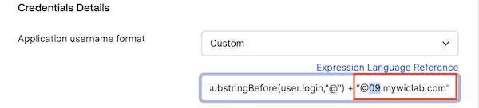||

4. Click **Done**.

Congratulations! Your Okta Workforce Identity Cloud and Office 365 tenant are now configured for single sign-on from Okta to Office 365.

## Configure Provisioning for Office 365

The single sign-on configuration performed in the previous section allows your Okta org to assert identity information to your Microsoft 365 tenant. However for single sign-on to work, each identity asserted by Okta must link to an existing Azure AD account.

The required Azure AD accounts could be created manually, or synced from a common identity source such as an on-premises AD but, in this case, you will set up provisioning in Okta so that it can automatically manage accounts in Azure AD. It will create accounts when users are assigned to the Office 365 app and deactivate these accounts when users are unassigned. It will also manage user attributes and licenses.

### Enable integration

Accounts in Azure AD can be managed via Microsoft APIs. To enable provisioning, Okta must be granted authority to call these APIs. Follow the steps below to grant this access and enable integration:

1. In the **Microsoft Office 365** app definition, select the **Provisioning** tab.
1. Click **Configure API Integration**.

    |||
    |:-----|:-----|
    |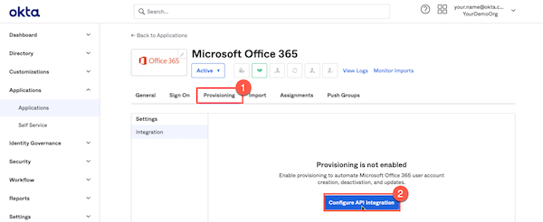|

1. Select **Enable API integration**.
1. Click **Authenticate with Microsoft Office 365**.

    |||
    |:-----|:-----|
    |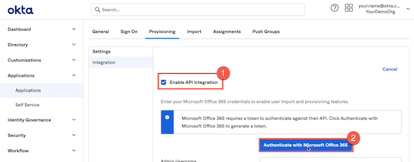|

1. Authenticate using the credentials for your Microsoft tenant from the launch panel.
1. On the **Permissions Requested** dialog, click **Accept** to grant the permissions requested by the Okta Microsoft Graph Client.
1. Click **Save**.

The API connection for provisioning is now in place. Provisioning configuration is now shown under the Provisioning tab. The integration configuration you just created is under the Integration tab.

There are two provisioning directions supported by this integration.

### Enable provisioning from Okta to App

In this section you will enable provisioning to Microsoft 365. This will include creation of accounts in Azure AD when users are assigned to the app, updating attributes in Azure AD when things change in Okta, and deactivating accounts in Azure AD when users are unassigned from the app in Okta.

1. On the **Provisioning** tab, under **Settings**, select **To App**.
1. Click **Edit** to set the options for provisioning from Okta to Office 365.
    |||
    |:-----|:-----|
    |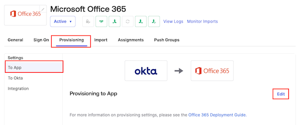|

1. For **Office 365 Provisioning Type**  select **Universal Sync**.
1. For **Create Users**, select **Enable**.
1. For **Update User Attributes**, select **Enable**.
1. For **Deactivate Users**, select **Enable**.
1. Click **Save**.
    |||
    |:-----|:-----|
    |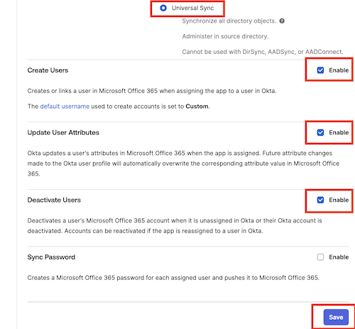|

|||
   |:-----|:-----|
   ||*Did you know that the Okta Integration Network boasts over 7,600 pre-built integrations, making it the Swiss Army knife of seamless connectivity? Integration innovation at its finest!*|

## Configure group assignment

When assigning users to an app, it's common to assign a group to an app and then assign users to the group.

When assigning a group to an app, you can specify values for app attributes. These will override any mapping for those attributes in the app definition. If you don't specify any value for an attribute, the mapping in the app definition will be applied instead.

## Assign Group to Application

You can assign a group to an app by assigning the group within the app definition.

1. In the **Microsoft Office 365** app definition, select the **Assignments** tab.
1. Click **Assign**, and then select **Assign to Groups**.
    |||
     |:-----|:-----|
     |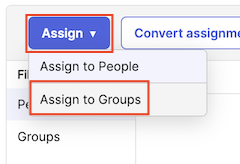||
1. Find the the **App-Office365-ProPlus** group, and then click **Assign**.
1. In the list of **Licenses**, find and select **Microsoft 365 E5 Developer (Without Windows and Audio Conferencing) - Office 365 ProPlus**.

    >**Hint:** Command-F (on Mac) or Win+F ( on Windows) will provide you a search bar into which you can type *proplus*

    |||
     |:-----|:-----|
     |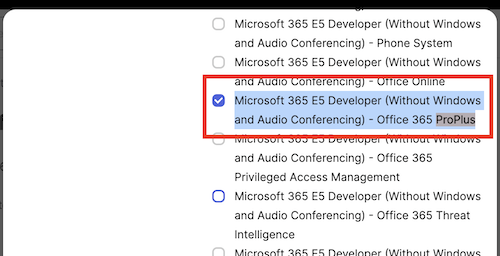 ||

1. Scroll down and click **Save and Go Back**.
1. Scroll down and click **Done**.

The application is now assigned to members of the **App-Office365-ProPlus** group.

## Assign User to Group

You will now assign the new employee to the *App-Office365-ProPlus* group. This will cause the user to be assigned the Microsoft Office 365 app which, in turn, will trigger provisioning of an account.

1. On the **Assignments** tab, select the **App-Office365-ProPlus** group.
    |||
     |:-----|:-----|
     |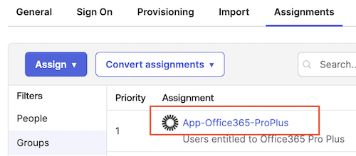 ||

1. On the **People** tab, click **Assign people**.
    |||
    |:-----|:-----|
    |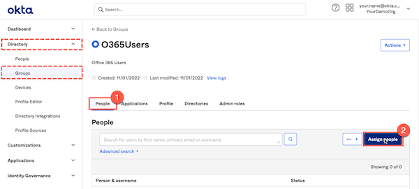|

1. Find your *new employee*, and then click the **+** icon on the right to assign them to the group.
    |||
    |:-----|:-----|
    |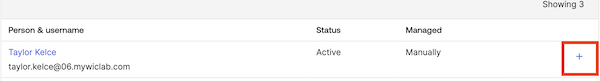|

1. Click **Done**.

The new employee is now a member of the group and will be assigned the Microsoft Office 365 app with an E5 Developer Office Pro Plus license.

## Verify SSO for New Employee to Office 365

In the **Virtual Desktop**, test single sign-on to Microsoft Office 365 for your new employee.

1. Open a new browser window, and enter your **Workforce Identity Cloud Sign-in URL** into the address bar.

    |||
    |:-----|:-----|
    |**Okta Sign-In URL:**|`https://{{idp.name}}.okta.com`|

1. Sign in with your **New Employee** username and password.
1. Click the **Microsoft Office 365 Word Online** app.
    |||
    |:-----|:-----|
    |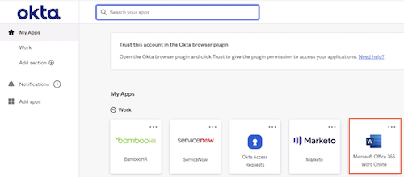|

1. Click **Yes** to stay signed in.
1. In the top-right corner of the page, click the identity icon.
1. Click **Sign out** to clear the session, and then close the browser tab.
    |||
    |:-----|:-----|
    |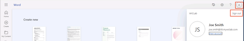|

8. Sign out the new employee from Okta

## Conclusion

With Okta and Microsoft Office 365 now in sync, we've demystified the art of fast and fuss-free integrations. Ready for immediate productivity? Check! Top-notch security? Double-check!
