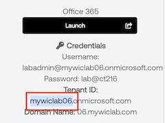
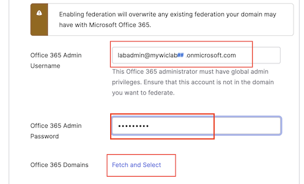
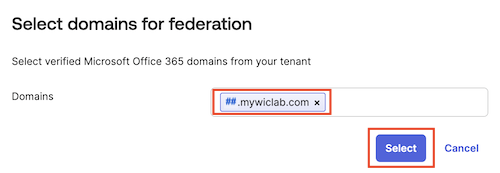
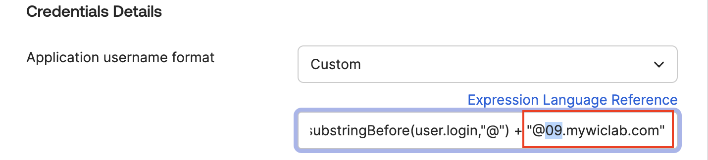
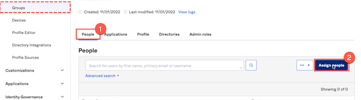

## Streamlining Workplace Productivity Tools

In this lab, we'll effortlessly integrate Okta with your Microsoft Office 365 environment. By leveraging the Okta Integration Network, you'll experience firsthand how modern application integrations can be both straightforward and rapid. Through the benefits of automated provisioning and single sign-on, employees will be poised for instant productivity. And even as we focus on a user-friendly experience, remember, security is always at the forefront.

## Add Microsoft Office 365 App to Okta for SSO

Okta maintains a specific integration for Microsoft Office 365 in the Okta Integration Network (OIN). To add this to your Okta org, follow these steps:

1. In the Admin Console select **Applications** >  **Applications**.
1. Click **Browse App Catalog**.
1. In the Browse App Integration Catalog **Search...** bar, type *office 365* and then click **Microsoft Office 365**.
1. Click **Add integration**.

    >**Tip:** For the next step, you will need the first part of your Office 365 **Tenant ID** from the lab launch panel.  
    
Be sure to leave off the *onmicrosoft.com* portion.

5. In the **General Settings** tab, set **Microsoft Tenant Name** to your Office 365 tenant name for the lab.

    

6. Scroll down and click **Next**.
7. In the **Sign On Options** tab, select **WS-Federation**.
8. Set the **Office 365 Admin Username** and **Office 365 Admin password** to the values from the lab launch panel.
9. Click **Fetch and Select**. This will display a list of your Office 365 Domains.

    

10. Select the **Office 365 Domain** that corresponds to the **Domain Name** in your lab launch panel.

> **Hint:**  Don't select the domain that ends in *onmicrosoft.com*.



### Customization with Okta Expression Language

12. In the Credential Details section, for **Application username format** select **Custom**.
13. For the **Custom** expression, enter the following:

    ```javascript
    String.substringBefore(user.login,"@") + "@nn.mywiclab.com"
    ```

14. Be sure to replace  **nn.mywiclab.com** in the expression with your unique **Domain Name**.

|Note:   ||
   |:-----|:-----|
   | The expression for the **Custom Application username format** transforms the new employee's email address domain to the Office 365 Domain you selected for federation.|

15. Click **Done**.

Congratulations! Your Okta Workforce Identity Cloud and Office 365 tenant are now configured for single sign-on from Okta to Office 365.

## Configure Provisioning for Office 365

The single sign-on configuration performed in the previous section allows your Okta org to assert identity information to your Microsoft 365 tenant. However for single sign-on to work, each identity asserted by Okta must link to an existing Azure AD account.

The required Azure AD accounts could be created manually, or synced from a common identity source such as an on-premises AD but, in this case, you will set up provisioning in Okta so that it can automatically manage accounts in Azure AD. It will create accounts when users are assigned to the Office 365 app and deactivate these accounts when users are unassigned. It will also manage user attributes and licenses.

### Enable integration

Accounts in Azure AD can be managed via Microsoft APIs. To enable provisioning, Okta must be granted authority to call these APIs. Follow the steps below to grant this access and enable integration:

1. Verify that you are still in the **Microsoft Office 365** app definition.
2. Select the **Provisioning** tab.
3. Click **Configure API Integration**.

    

4. Select **Enable API integration**.
5. Click **Authenticate with Microsoft Office 365**.

    

6. Authenticate as the lab admin user for your Microsoft tenant.
7. On the **Permissions Requested** dialog, click **Accept** to grant the permissions requested by the Okta Microsoft Graph Client.
8. Click **Save**.

The API connection for provisioning is now in place. Provisioning configuration is now shown under the Provisioning tab. The integration configuration you just created is under the Integration tab.

There are two provisioning directions supported by this integration.

### Enable provisioning to app

In this section you will enable provisioning to Microsoft 365. This will include creation of accounts in Azure AD when users are assigned to the app, updating attributes in Azure AD when things change in Okta, and deactivating accounts in Azure AD when users are unassigned from the app in Okta.

> **Note:** In general, Okta does not delete accounts from apps - it only deactivates them. This ensures that Okta is not responsible for any data loss in the backend system that could be triggered by deleting an account.

Follow these steps to enable provisioning:

1. On the **Provisioning** tab, under **Settings**, select **To App**
2. Click **Edit** to set the options for provisioning from Okta to Office 365.

    

3. For **Office 365 Provisioning Type**  select **Universal Sync**.
4. For **Create Users**, select **Enable**.
5. For **Update User Attributes**, select **Enable**.
6. For **Deactivate Users**, select **Enable**.
7. Click **Save**.

 

|||
   |:-----|:-----|
   ||*Did you know that the Okta Integration Network boasts over 7,600 pre-built integrations, making it the Swiss Army knife of seamless connectivity? Integration innovation at its finest!*|

# Configure group assignment

When assigning users to an app, it's common to assign a group to an app and then assign users to the group.

When assigning a group to an app, you can specify values for app attributes. These will override any mapping for those attributes in the app definition. If you don't specify any value for an attribute, the mapping in the app definition will be applied instead.

## Assign Group to Application

You can assign a group to an app by assigning the group within the app definition.

1. On the **Assignments** tab, click **Assign**, and then select **Assign to Groups**.
1. Find the the **App-Office365-ProPlus** group, and then click **Assign**.
1. In the list of Licenses, find and select **Microsoft 365 E5 Developer (Without Windows and Audio Conferencing) - Office 365 ProPlus**.

    >**Hint:**Command-F (on Mac) or Win+F ( on Windows) will provide you a search bar into which you can type *proplus*

    

6. Scroll to the bottom of the page and click **Save and Go Back**.
7. Click **Done**.

The application is now assigned to the **App-Office365-ProPlus** group.

## Assign User to Group

You will now assign the new employee to the *App-Office365-ProPlus* group. This will cause the user to be assigned the Microsoft Office 365 app which, in turn, will trigger provisioning of an account.

1. In the Admin Console select **Directory** > **Groups**.
2. Select the **App-Office365-ProPlus** group.
3. Select the **People** tab within the **App-Office365-ProPlus** group.
4. Click **Assign people**.

    

5. Click **+** for the **New Employee** to assign them to the group.

    

The **+** icon will change to say **Assigned**.
6. Click **Done**.

The user is now assigned to the group and will be assigned to the Microsoft Office 365 app using the attribute mapping associated with the group assignment.

## Verify SSO for New Employee to Office 365

In your Virtual Desktop, test single sign-on to Microsoft Office 365 for your new employee.

1. Open a new browser window that is not signed in to Okta or Microsoft.

2. Enter the sign-in URL to your Okta org, For example *<https://demo-xxxxxx-xxxxx-nnnnn.okta.com>*

3. Authenticate as the new employee. For example *<flynn.rider@04.mywiclab.com>*

4. Click the **Microsoft Office 365 Word Online** app.

    

5. Click **Yes** to stay signed in.
6. In the top-right corner of the page, click the identity icon.
7. Click **Sign out** to clear the session.

    

8. Sign out the new employee from Okta

## Conclusion

With Okta and Microsoft Office 365 now in sync, we've demystified the art of fast and fuss-free integrations. Ready for immediate productivity? Check! Top-notch security? Double-check!
