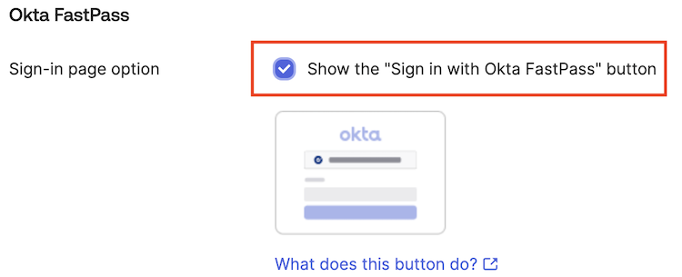
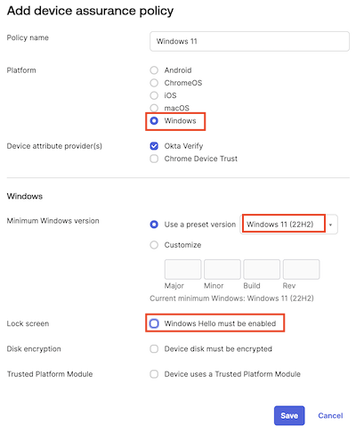
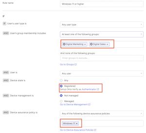

In this lab, you will unlock the combined power of Okta Verify and FastPass. You will enable an experience where passwordless authentication becomes an integral part of an employee’s workday, boosting employee productivity without the common password pitfalls. Not only will you discover an enhanced security posture resistant to phishing threats, but you’ll also appreciate the inherent protection it offers, sometimes even against our own human errors.

## Setup Okta Verify and Okta FastPass

>**Tip:** You may want paste your Okta tenant url into Notepad++ for easy copying and pasting in this lab.

### Download Okta Verify on your Virtual Machine

1. In the Okta Admin Console, select **Settings** > **Downloads**.
1. Scroll down to **Okta Verify for Windows (.exe)** and click **Download General Availability**.
1. Sign out of Okta and close the browser.

### Install Okta Verify on your Virtual Machine

1. Open the downloaded **Okta Verify Setup** executable file.
2. In the Okta Verify installation window, select **I agree to the License terms and conditions**, and then click **Install**.
    Wait for confirmation saying that Okta Verify was successfully installed.
3. Click **Finish**.

### Add New Employee Account to Okta Verify

1. On the VM desktop, find and open **Okta Verify**.

1. On **Welcome to Okta Verify**, click **Get started**.

1. Click **Next**.

1. For **New Account**, enter your Okta tenant URL. For example: <https://demo-xxxxxx-xxxxx-xxxxx.okta.com>.
1. Click **Next**.
This will open your Okta tenant's sign-in page.

1. Sign in with your **New Employee** username and password and Okta Verify MFA.
Upon successful authentication, the new employee account will be added to the Okta Verify desktop app.

## Configure Security Policies and FastPass

|||
   |:-----|:-----|
   ||*Did you know with Okta Adaptive MFA, you get personalized security that learns from your habits, making logging in a breeze while keeping intruders at bay? Think of it as the bouncer who always spots the VIP - that's you!*|

## Enable Okta Verify for FastPass Authentication

1. In the Admin Console, select **Security** > **Authenticators** > **Setup** tab.

1. For **Okta Verify**, click **Actions**, and then select **Edit**.
This will display the Okta Verify options.

1. For **Okta FastPass** select **Show the "Sign in with Okta FastPass" button**.
1. Scroll down and click **Save**.

### Add a rule to the "Any two factors" policy

1. In the Admin Console, select **Security** > **Authentication Policies**.
2. Select the  **Any two factors** authentication policy.
3. Click **Add Rule**.
4. Set the **Rule name** to **Okta FastPass**
5. Set the following **IF** conditions for the rule:

    | IF | Value|
    |:-----|:-----|
    |User's  type is| Accept the default |
    |User's group membership includes|**At least one of the following groups:**|
    | Enter groups to include: |  **Digital Marketing** and **Digital Sales**|
     | Device state is: |  **Registered**|'

    

6. Set the following **THEN** access and authentication settings for the rule:

    |THEN||
    |:-----|:-----|
    |User must authenticate with:| **Possession factor**|
    |If Okta FastPass is used |**The user is not required to approve a prompt in Okta Verify or provide biometrics**|

7. Click **Save**.

### Experience an Employee Passwordless Login

1. Launch a Chrome browser window using the Guest profile.
1. Enter your Okta tenant URL in the browser.
1. At the Okta login, click **Sign in with Okta FastPass** . You will be signed in to the End-User Dashboard, no password required.

## Set Up User Behavioral Analytics

### Add a Device Assurance Policy

With device assurance policies you can check security-related device attributes as part of your authentication policies.

1. In the Admin Console, select **Security** > **Device Assurance Policies**.
2. Click **Add a policy**.
3. Set **Policy name** to **Windows 11**
4. For **Platform**, select **Windows**.
5. For **Minimum Windows version**, select **Windows 11(21H2)**.
6. For **Lock Screen**, deselect **Windows Hello must be enabled**.
7. Click **Save**.

    

### Add Authentication Policy Rule with Device Assurance

1. In the Admin Console, select **Security** > **Authentication policies**.
1. Click **Any two factors**.
1. Click **Add rule**.
1. Set the **Rule name** to **Windows 11 or higher**
1. Set the following **IF** conditions for the rule:

    | IF | Value|
    |:-----|:-----|
    |User's  type is| Accept the default |
    |User's group membership includes|Select the **Digital Marketing** and **Digital Sales** groups.|
     | Device state is: |  **Registered**|
     | Device assurance policy is| Select the **Windows 11** policy|'

    

1. Set the following **THEN** access and authentication settings for the rule:

    |THEN||
    |:-----|:-----|
    |User must authenticate with:| **Possession factor**|
    |If Okta FastPass is used |**The user is not required to approve a prompt in Okta Verify or provide biometrics**|

1. Click **Save**.

### Add a Deny Rule for non-compliant Devices

1. Within the **Any two factors** policy, click **Add Rule**.
1. Set the **Rule name** to **Deny Rule - Digital Marketing**
1. Set the following **IF** conditions for the rule:

    | IF | Value|
    |:-----|:-----|
    |User's  type is| Accept the default |
    |User's group membership includes|Select the **Digital Marketing** and **Digital Sales** groups.|,

1. Set the **THEN**  **Access is** settings to **Denied**.
1. Click **Save**.

### Test the Device Assurance Policy

The lab Virtual Desktops are running Windows 10.

1. In your Virtual Desktop environment, try to sign in to as your new employee. You will be denied.
1. Go back to your virtual environment.
1. Select **Security** > **Authentication policies**.
1. Click **Any two factors**.
1. For the **Windows 11 or higher** rule, click **Actions** and then select **Deactivate**.
1. For the **Deny Rule - Digital Marketing**, click **Actions** and then select**Deactivate**.

This will allow sign in from the Virtual Desktop.

### Enable Okta ThreatInsight

Okta ThreatInsight aggregates data about sign-in activity across the Okta customer base to analyze and detect potentially malicious IP addresses and to prevent credential-based attacks such as: password spraying, credential stuffing, and brute-force cryptographic attacks. Because ThreatInsight collects information about the origin of sign-in activity directed at Okta organizations and Okta endpoints, it provides a security baseline for all Okta customers.

To enable Okta ThreatInsight, proceed with the following steps:

1. In the Admin Console, select **Security** > **General**.
2. Scroll down to Okta ThreatInsight settings and click **Edit**.
3. Select **Log and enforce security based on threat level**.
This setting will make Okta automatically deny access to sign-in requests that come from potentially malicious IP addresses that ThreatInsight detects.
4. Click **Save**.
