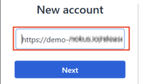
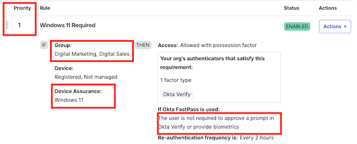

In this lab, you will unlock the combined power of Okta Verify and FastPass. You will enable an experience where passwordless authentication becomes an integral part of an employee’s workday, boosting employee productivity without the common password pitfalls. Not only will you discover an enhanced security posture resistant to phishing threats, but you’ll also appreciate the inherent protection it offers, sometimes even against our own human errors.

## Setup Okta FastPass on the Virtual Desktop

### Install Okta Verify on your Virtual Desktop

1. In the Virtual Desktop, there is a Download folder shortcut which contains the **Okta Verify Setup** executable. Run the executable.
1. In the Okta Verify installation window, select **I agree to the License terms and conditions**, and then click **Install**.
    Wait for confirmation saying that Okta Verify was successfully installed.
1. Click **Finish**.

### Add New Employee Account to Okta Verify

1. In the Virtual Desktop, find and open **Okta Verify**.

1. On **Welcome to Okta Verify**, click **Get started**.

1. Click **Next**.

1. For **New Account**, enter **https://** followed by your Okta **Tenant** from the launch panel.
    |||
     |:-----|:-----|
     || |
1. Click **Next**.
This will open your Okta tenant's sign-in page.

1. Sign in with your **New Employee** username and password.
1. Close the Okta Verify window,and then close the browser.

## Configure Security Policies and FastPass

|||
   |:-----|:-----|
   ||*Did you know with Okta Adaptive MFA, you get personalized security that learns from your habits, making logging in a breeze while keeping intruders at bay? Think of it as the bouncer who always spots the VIP - that's you!*|

## Enable Okta Verify for FastPass Authentication

1. In the Admin Console, select **Security** > **Authenticators**.
1. For **Okta Verify**, click **Actions**, and then select **Edit**.
1. For **Okta FastPass** select **Show the "Sign in with Okta FastPass" button**.
    |||
   |:-----|:-----|
    ||
1. Scroll down and click **Save**.

### Add a rule to the Standard Security Apps policy

1. In the Admin Console, select **Security** > **Authentication Policies**.
2. Select the  **Standard Security Apps** authentication policy.
3. Click **Add Rule**.
4. Set the **Rule name** to **Okta FastPass**
5. Set the following **IF** conditions for the rule:
    | IF | Value|
    |:-----|:-----|
    |User's  type is| Accept the default |
    |User's group membership includes|**At least one of the following groups:**|
    | Enter groups to include: |  **Digital Marketing** and **Digital Sales**|
     | Device state is: |  **Registered**|'

    |||
   |:-----|:-----|
    ||

6. Set the following **THEN** access and authentication settings for the rule:

    |THEN||
    |:-----|:-----|
    |User must authenticate with:| **Possession factor**|
    |If Okta FastPass is used |**The user is not required to approve a prompt in Okta Verify or provide biometrics**|

    |||
     |:-----|:-----|
    ||
7. Click **Save**.
8. Drag the **Okta FastPass** rule up to make it **Priority 1** in the list of rules for the policy.
    |||
     |:-----|:-----|
    ||

### Experience an Employee Passwordless Login

1. In the **Virtual Desktop**, launch a Chrome browser.
1. Enter your Okta **Tenant** URL in the browser. You will be automatically authenticated to your End-User Dashboard. No prompts, no typing, pure magic!
1. Sign out of Okta.
1. At the Okta login, click **Sign in with Okta FastPass**. Again, you will be signed in to the End-User Dashboard, no password required.

## Set Up Device Assurance

### Add a Device Assurance Policy

With device assurance policies you can check security-related device attributes as part of your authentication policies.

1. In the Admin Console, select **Security** > **Device Assurance Policies**.
1. Click **Add a policy**.
1. Set **Policy name** to **Windows 11**
1. For **Platform**, select **Windows**.
1. For **Minimum Windows version**, select **Windows 11 (22H2)**.
1. For **Lock Screen**, deselect **Windows Hello must be enabled**.
7. Click **Save**.

    |||
   |:-----|:-----|
    ||

### Add Device Assurance Rule to High Security Apps Policy

1. In the Admin Console, select **Security** > **Authentication policies**.
1. Click **High Security Apps**.
1. Click **Add rule**.
1. Set the **Rule name** to **Windows 11 or higher**
1. Set the following **IF** conditions for the rule:

    | IF | Value|
    |:-----|:-----|
    |User's  type is| Accept the default |
    |User's group membership includes|Select the **Digital Marketing** and **Digital Sales** groups.|
     | Device state is: |  **Registered**|
     | Device assurance policy is| Any of the following device assurance polices|
     | |Select the **Windows 11** policy|

1. Set the following **THEN** access and authentication settings for the rule:

    |THEN||
    |:-----|:-----|
    |User must authenticate with:| **Possession factor**|
    |If Okta FastPass is used |**The user is not required to approve a prompt in Okta Verify or provide biometrics**|
1. Click **Save**.
1. Drag the **Windows 11 or higher** rule up to make **Priority 1** in the list of rules for the policy.

    |||
   |:-----|:-----|
    ||

### Add Marketo to the High Security Apps Policy

1. In the **High Security Apps** policy, select the **Applications** tab.
1. Click **Add app**.
1. Select the **Marketo** app, and then select the **Sign On** tab.
1. For **Marketo**, click **Add**, and then click **Close**.
    |||
     |:-----|:-----|
    ||

### Test the Device Assurance Policy

1. In your Virtual Desktop environment, on the Okta Verify app **Accounts** page, click the device health icon to verify that your OS version is version 10.
    |||
   |:-----|:-----|
    ||

1. In your Virtual Desktop environment, sign in as your new employee.
1. Select the **Marketo** app. You will be denied.

    |||
    |:-----|:-----|
    ||

### Switch the Authentication Policy for Marketo

1. In the Admin Console, select **Security** > **Authentication Policies**.
1. Select **High Security Apps** > **Applications** tab.
1. For the **Marketo** app, click **Switch Policy**.
1. Select the **Standard Security Apps** policy, and then click **Save** .
    |||
     |:-----|:-----|
      ||

Your new employee will now be able to sign in to **Marketo** from the Virtual Desktop.

>**Note:** With the exception of BambooHR and Office 365, the apps in this lab are Bookmark apps. Bookmark apps are used to direct users to a specific web page using Okta applications.

### Enable Okta ThreatInsight

Okta ThreatInsight aggregates data about sign-in activity across the Okta customer base to analyze and detect potentially malicious IP addresses and to prevent credential-based attacks such as: password spraying, credential stuffing, and brute-force cryptographic attacks. Because ThreatInsight collects information about the origin of sign-in activity directed at Okta organizations and Okta endpoints, it provides a security baseline for all Okta customers.

To enable Okta ThreatInsight, proceed with the following steps:

1. In the Admin Console, select **Security** > **General**.
2. Scroll down to Okta ThreatInsight settings and click **Edit**.
3. Select **Log and enforce security based on threat level**.
This setting will make Okta automatically deny access to sign-in requests that come from potentially malicious IP addresses that ThreatInsight detects.
4. Click **Save**.

## Conclusion

In this lab, we've journeyed beyond traditional barriers, tapping into the wonders of Okta Verify and FastPass. Goodbye, cumbersome passwords and hello, sleek passwordless wonders! Together, we’ve fortified our defenses against those sneaky phishers and, yes, even our own little mishaps. Here's raising a toast to a future of ease, enhanced security, and fewer facepalms!
