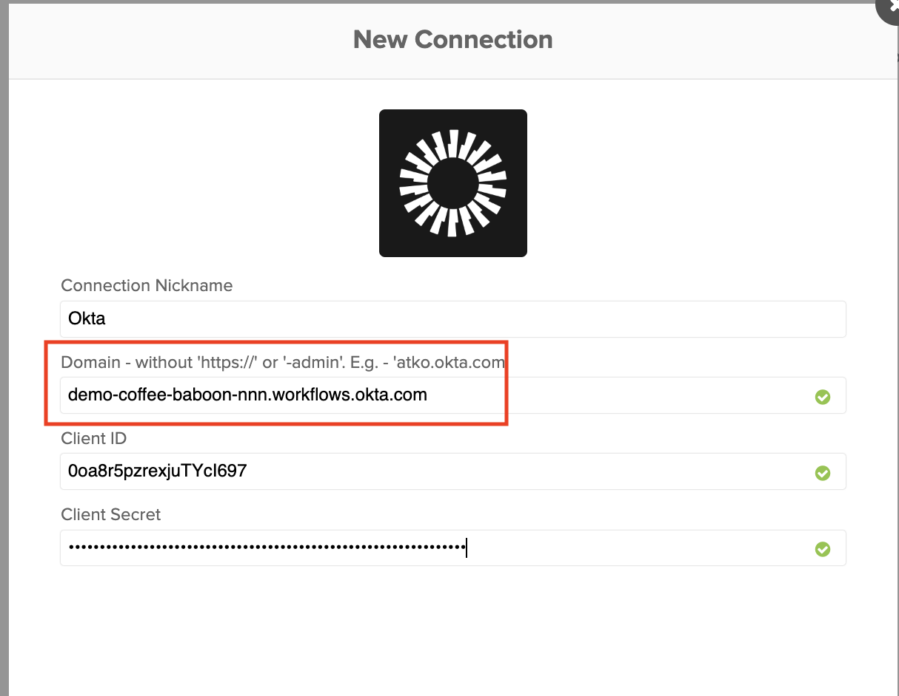

## Requests, Approvals, and Access Certifications

In this lab, you will navigate the pathways of application access requests, demonstrating the seamless experience for employees itching to get their hands on the tools they need. But there's a twist, approvals are in play! You'll witness the streamlined process of granting access post-approval, while also exploring the administrative side of things. Here, setting up approvals becomes a breeze, and configuring certification for periodic access reviews? Consider it done. Ready to experience the future of governed access?

### Assign Access Request App to Everyone

1. In the Admin Console select **Applications** > **Applications**
2. Select the **Okta Access Requests** app.
3. Select the **Assignments** tab.
4. Click **Assign** and then select **Assign to Groups**.
5. Find for the **Everyone** group, and then click **Assign**.
6. Click **Done**.

### Configure Access Request Settings

1. In the Okta Admin Console select **Identity Governance** > **Access Requests**. This will open the Access Requests Admin Console in a new browser tab.
2. In the Access Requests Admin Console, select **Teams** > **All**.
3. Click the **IT** team.
4. Click **Add Member**.
5. Enter your Okta Admin name and then select **You**.
6. Click **Add Users**.
7. Verify that you are listed as a member of the IT team.
8. In the Access Requests Admin Console, select **Settings**.
9. Select the **Integrations** tab.
10. Under Access Request Configurations for Okta, click **Edit connection**.
11. Click **Update Connection.**
12. Select the **Resources** tab.
13. For both Applications and Okta Groups, click **Manage Access** and select the **IT** team.

### Create a Request Type

A request type can consist of multiple steps including Questions, Tasks, Approvals, and Actions. This request type will consist of an Approval step and an conditional Action step.

1. In the Access Requests Admin Console, select **Access Requests**
2. Click **Create request type**.
3. Configure the request type as follows:

    |Request Type attribute|Value|
    |:-----|:-----|
    |Name|**Navan**|
    |Description |  **Corporate Travel App**|
    |Team |**IT**|
    |Audience|**Everyone at** your demo org|'

4. Click **Continue**.
5. To add an **Approval** step, click **Add to request type**.
6. In the Approval panel, configure the approval as follows:

    |Approval attribute |Value|
    |:-----|:-----|
    |Text|**Admin Approval**|
    |Make it a required task |  **Enabled**|
    |Type| **Approval task**|
    |Assigned to |Select **A specific user...** and click **You**|'

7. To add an Action step, towards the bottom of the page, click **Action**, and then select **Assign individual app to user**.
8. In the **Action** panel, configure the action as follows:

    |Action attribute|Value|
    |:-----|:-----|
    |Text|**Assign to Navan**|
    |Make it a required task |  **Enabled**|
    |Type | **Assign individual app to user**|
    |Run automatically |**Enabled**|
    |Email address|**Requester email**|
    |Select application | **Navan**|
    |Run automatically | **Enabled**|'

9. Click **Edit Logic**.
10. Click **Always show this task**, and then select **Only show this task if**.
11. Click **Field or Task**.and then select **Admin Approval**
12. Select **is approved**.
13. Click **Publish**.
14. Leave this browser session open as you will return back to it momentarily.

### As the new employee, request access to an app

1. Open a new Chrome window using the Guest profile
2. Sign in to your Okta org as the New Employee.
3. In the End-User Dashboard, open the **Okta Access Requests** app.
5. In the App Catalog, locate **Navan**, and click **Request access**.
6. Preview the request, and click **Submit new request**.
7. Leave this browser session open as you will return back to it momentarily.

### As the Okta admin, approve the access request

1. Return to your Okta admin browser session
2. In the Access Requests Admin Console, select **Requests** > **Inbox**.
3. Click on the Navan app request from the new employee, and then click **Approve**.
4. Select the **Activity** tab to verify that the app was assigned to the new employee.

### As the new employee, verify access to the app

1. Return back to the new employee browser session.
2. Reload the End-User Dashboard, and verify the new employee has access to Navan.

## Workflow Connections

Now, let's configure the following Okta connectors in your Okta Tenant with Workflow enabled.

### Create an Okta Connection

1. In the Okta Admin Console select **Workflow** > **Workflows console**.

>**Note:** Your browser window now has an open tab open for the **Okta Admin Console** and another tab for the **Workflows Console**. Throughout this lab, you will be navigating between the two consoles, so pay close attention.

2. In the Workflows console, select **Connections**, and then click **New Connection**.
3. Enter **okta** in the search bar, and then click **Okta**.
4. Optional. Modify the default **Connection Nickname**.
5. Set **Domain** to the full domain of your Okta tenant.
 Be sure to include the **.okta.com** portion of the domain.

Keep this page open. You'll need to switch to your Okta Admin Console to get the **Client ID** and **Client Secret** values needed for this Okta Connection and then return to the Workflows console to paste in the values.

#### Copy and paste the Client ID and Client Secret

1. In the Okta Admin Console, select **Applications** > **Applications**.
2. Select the **Okta Workflows OAuth** app, and then select the **Sign On** tab.
3. Copy the **Client ID**
4. Return to the **Workflows console** >  **New Connection** dialog, and then paste the **Client ID**.
5. Repeat the copy and paste steps for the **Client secret**.
6. Click **Create** to complete the Okta Connection.

### Create an API Connection

1. In the Workflows console, select **Connections**, and then click **New Connection**.
2. Enter **api** in the search bar, and then click **API Connector**.
3. Optional. Modify the default **Connection Nickname**.
4. For **Auth Type** select **Custom**.
5. Set **Header Name** to **Authorization**.

Keep this page open. Before you can set the **Header Value** for this API Connection,  you'll need to switch to your Okta Admin Console to obtain an API token. You will then return to the Workflows console to finish this configuration.

#### Create, copy and paste an API Token

For the workflows in the Okta Workflow Pack to work, you will first need to create a token to connect Okta APIs for that :

1. In the Okta Admin Console, select **Security** > **API**, and then select the **Tokens** tab
<!--

-->

2. Set the Token name to **WIC Lab Token**
3. Click **Create token**.
4. Copy the **Token Value**.
5. Return to the **Workflows console** >  **New Connection** dialog.
6. Set **Header Value** to **SSWS**, followed by a space, and then paste the **Token Value**.
Click **Create** to complete the API Connection.
<!--

-->

## Leveraging Flowpacks

|||
   |:-----|:-----|
   ||*Did you know that Okta Identity Governance, powered by Okta Workflows, lets you smoothly look up a user's manager or application owner during access certifications? It's technology bending to fit your business process, not the other way around – like having your digital cake and eating it too!*|

### Download the **Title Change** flowpack

1. Download the lab flowpack **titleChanged.flow**  from the link provided.

### Create a new Folder

1. In the Workflows console, select **Flows**.
2. In the **Folders** panel, create a new folder by clicking the **+** icon.
3. Set the **Folder name** to **Title Change**.
4. Optional. Set a **Folder Description**.
5. Click **Save**.
<!--

-->

### Import the Flow into the Folder

1. Click on the **...** next to the newly created folder and select Import
2. Click **Choose file from computer**, and then click **Open**.

    

You have successfully imported the Flow.
<!-->

-->

### Modify the imported Flow

There are a few modifications needed within the workflow. You will need to assign the Okta and API connections to the flow. You'll also need to specify your Okta tenant domain and your Okta admin account.

1. Click on the Workflow to update the existing cards
<!--

-->
2. In the **User Okta Profile Updated** card, and then set the **Connection** to your **Okta** connection.
3. Update the first **Compose** card to contain your Okta tenant name. This card will set **varOktaTenantURL** to the value you entered.
4. Update the next **Compose** card to contain your Okta admin login.  This card will set **varAdminLogin** to the value you entered.
5. In the **API Connector Raw Request** card, set the **Connection** to your **API Connector** connection.
<!--

-->
6. Click **Save**

    > **Note:** When saving for the first time, select **Save all data that passes through the Flow?**, and then click **Save**.
<!--

-->
4. Click **Flow is OFF** and select **Flow is OFF**. The result will be that the **Flow is ON** and **Saving data**.
<!--

-->
You now have the Flow correctly configured and running.

### Change the new employee's title

In order to trigger this Flow, an action we're listening to should occur. In this case, an existing user will have their title updated.

1. In the BambooHR dashboard search for and select your new employee.
2. On the **Job** tab, for **Job Information** click  **Add Entry**.
3. In the **Add Job Information** dialog, select a different title, and then click **Save**.

### Import the Title Change into Okta

1. In the Okta Admin Console, select **Applications** > **Applications**.
2. Select the  **BambooHR** app, and then select the **Import** tab.
<!--

-->
3. Click **Import Now**.
4. When the scan completes, confirm that one user was updated.
<!--

-->

This event will trigger the imported **Title Changed** flow, which creates and launches a certification campaign.

## Access Certification

Access certification is built into the Okta platform. There is an administrative interface to create and manage campaigns and an end-user interface for participating in campaigns.
Campaigns can be created via API and the UI of the admin platform.

### Verifying the Access Certification Campaign

To verify that a certification campaign was created by the flowpack, you will need to perform the following actions:
<!-->
#### Validate the created campaign

Before proceeding with the certification campaign, make sure that the user has at least one application assigned and the user is able to access that application.
-->
1. In the Okta Admin Console select **Identity Governance** > **Access Certifications**.
2. Verify that there is **Campaign** whose name starts with **Title Change:**.
3. Click on the **Title Change:**campaign to see an overview of the campaign.

The page provides an overview of the campaign, the progress of the campaign, and the items to be reviewed.An administrator can use this page to manage the execution of a campaign. They can see the progress and any items still outstanding. They can reassign one or more items. They can also prematurely end the campaign.

>**Note:** Please notify a lab assistant if there is no campaign listed.

<!-->

-->

<!-->

-->

### Participating in an Access Certification Campaign

For the purposes of this lab, we decided to assign the Okta tenant administrator ( You ) to be the certifier of this particular campaign. However, you will need to access the **Okta Access Certification Reviews** app from your End User Dashboard.

### Review the Access Certification Campaign

1. In the Okta Admin Console, click on the *waffle icon* in the top right corner, and select  **My end user dashboard**,
 by clicking on the **Drop down menu** in the top right corner and click on **My End User Dashboard**
2. In the End User Dashboard, launch the **Okta Access Certification Reviews** app.
3. Click on the **Title Change** to see an overview of the campaign.
<!--

> **Note:** This app is tied to a group where membership is dynamically managed within Okta. If an Okta user is flagged as a reviewer in any active campaign, they will be in the group and see the application on the dashboard.

You are presented with a list of campaigns for which the user is a reviewer. You see a summary of information about each active campaign.

3. On the following page, you can see all of the open and closed review campaigns. Click on the **Campaign Name**

-->:

4. You will see all applications assigned to this user.
<!--

-->
> For each item, you have three options as a reviewer: Approve (leave the access as is), Revoke (remove access or flag for it to be removed), or Reassign (to another Okta user). You will see the icons or icons and words depending on the screen resolution.

5. Click on the name of one of the applications to see information about the user and resource
<!-->

-->
This information is provided to help the reviewer in making their decision. Currently, it includes user details and resource details, but there are plans to include fine-grained access information (if available) and review history.

6. Click **Approve**.
<!-->

-->
7. When prompted, enter a **Justification**,  and then click the **Submit**.
<!--
8. Select one user and click the Revok (X) button

After each action, you will see a message displayed, and the item will disappear from the view (they can be found under the Closed tab). When all are actioned, you will get confirmation that you are done with the reviews.

-->
### End the Campaign

The campaign can be completed manually once the review is done or automatically after the **Set duration** passes.

1. In the Okta Admin Console select **Identity Governance** > **Access Certifications**.
2. Click the **Title Change** campaign and verify that the **Progress** is **100%**.
3. To end the campaign, click **Actions**, and then select **End**.
4. Click **End Campaign**.

    
<!--

-->
