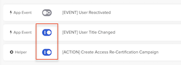

## Requests, Approvals, and Access Certifications

In this lab, you will navigate the pathways of application access requests, demonstrating the seamless experience for employees itching to get their hands on the tools they need. But there's a twist, approvals are in play! You'll witness the streamlined process of granting access post-approval, while also exploring the administrative side of things. Here, setting up approvals becomes a breeze, and configuring certification for periodic access reviews? Consider it done. Ready to experience the future of governed access?

## Configure Teams and Access Request Settings

 

### Add Okta admin to the IT team

1. In the **Okta Admin Console** select **Identity Governance** > **Access Requests**. This will open the Access Requests Admin Console in a new browser tab.
1. In the Access Requests Admin Console, select **Teams**.
1. Click the **IT** team.
1. Click **Add member**.
1. Enter your Okta Admin name and then select **You**.
1. Click **Add Users**.
    |||
     |:-----|:-----|
    ||

7. Verify that you are listed as an **IT** team member.

### Provide IT Team Access to Okta Apps & Groups

1. In the Access Requests Admin Console, select **Settings**.
1. Select the **Resources** tab.
1. For **Applications**, click **Manage Access**.
1. Select the **IT** team, and then click **Save**.
1. Select **Okta Groups**, and then click **Manage Access**.
1. Toggle on the **IT** team, and then click **Save**.
    |||
     |:-----|:-----|
    ||

## Create a Request Type for Navan App

 

A request type can consist of multiple steps including Questions, Tasks, Approvals, and Actions. This request type will consist of an Approval step and a conditional Action step.

1. In the Access Requests Admin Console, select **Access Requests**
1. Click **Create request type**.
1. Configure the request type as follows:

    |Request Type attribute|Value|
    |:-----|:-----|
    |Name|**Navan**|
    |Description |  **Corporate Travel App**|
    |Team |**IT**|
    |Audience|**Everyone at {{idp.name}}**|'

1. Click **Continue**.
    |||
     |:-----|:-----|
    ||

### Add an Approval step to the Request

1. To add an Approval step, select **Approval**, and then click **Add to request type**.
    |||
     |:-----|:-----|
    ||

1. In the **Approval Details** panel, on the right, configure the Approval step:

    |Approval attribute |Value|
    |:-----|:-----|
    |Text|**Admin Approval**|
    |Make it a required task | *Enabled*|
    |Type| **Approval task**|
    |Assigned to |Select **A specific user...** and select **You**|
    |Due Date| *No due date*|'

    |||
     |:-----|:-----|
    |

> **Tip:** Look at the bottom of the **Tasks & Actions** for additional step buttons.
>
### Add an Action step

1. To add an Action step, click **Action**, and then select **Assign individual app to user**.
1. In the **Action Details** tab, on the right, configure the Action step:

    |Action attribute|Value|
    |:-----|:-----|
    |Text|**Assign to Navan**|
    |Make it a required task |  *Enabled*|
    |Type | *Assign individual app to user*|
    |Run automatically |Toggle **On**. Additional fields will appear.|
    |Email address| Select **Requester email**|
    |Select application |Select  **Navan** from the list of apps|
    |Run automatically | *Enabled*|'

1. Click **Edit Logic**. This will switch you from the Details tab to the Logic tab.
    |||
    |:-----|:-----|
    ||
1. Click **Always show this task**, and then select **Only show this task if**.
1. Click **Field or Task**.and then select **Admin Approval**
1. Select **is approved**.
1. Click **Publish**.
    |||
     |:-----|:-----|
    ||

8. Leave this browser session open as you will return back to it momentarily.

## As the New Employee, request access to Navan

 

1. In the **Virtual Desktop**, open a new Chrome window.
1. Sign in to your Okta tenant as the New Employee.
1. In the End-User Dashboard, open the **Okta Access Requests** app.
1. In the App Catalog, locate **Navan**, and then click **Request access**.
1. Click **Submit new request**.
1. Notice there are 0/1 tasks are complete. The access request is waiting for Admin Approval.
    |||
     |:-----|:-----|
    ||

7. Leave this browser session open as you will return back to it momentarily.

## As the Okta admin, approve the access request

 

1. Return to your Okta admin browser session
1. In the Access Requests Admin Console, select **Requests** > **Inbox**.
1. Click on the Navan app request from the new employee, and then click **Approve**.
    |||
     |:-----|:-----|
    ||

4. Optional. Select the **Activity** tab to verify that the app was assigned to the new employee.

## As the New Employee, verify access to Navan

 

1. Return back to the new employee browser session
2. Reload the End-User Dashboard, and verify the new employee has access to Navan.

## Okta Workflows for Access Certifications

 In this section of the lab, you'll set up two workflow connections and then import and configure a flowpack. When activated, this flow will automate the creation of access certification campaigns whenever an employee's title changes.

## Create an Okta Connection

 

1. In the Okta Admin Console select **Workflow** > **Workflows console**. This will open the Workflows console in a new browser tab.

>**Note:** Your browser window now has an open tab open for the **Okta Admin Console** and another tab for the **Workflows Console**. Throughout this lab, you will be navigating between the two consoles, so pay close attention.

2. In the Workflows console, select **Connections**, and then click **New Connection**.
1. In the **New Connection** dialog search bar, enter **okta** and then click **Okta**.
1. Optional. Change the **Connection Nickname**.
1. Set the **Domain** to `{{idp.name}}.okta.com`

Keep this page open. You'll need to switch to your Okta Admin Console to get the **Client ID** and **Client Secret** values needed for this Okta Connection and then return to the Workflows console to paste in the values.

### Copy and paste the Client ID and Client Secret

1. In the Okta Admin Console select **Applications** > **Applications**, and then select the **Okta Workflows OAuth** app.
1. In the app definition, select the **Sign On** tab.
1. Copy the **Client ID**
1. Return to the **Workflows console** >  **New Connection** dialog, and then paste the **Client ID**.
1. Repeat the copy and paste steps for the **Client secret**.
1. Click **Create** to complete the Okta Connection.
    |||
     |:-----|:-----|
     ||

## Leveraging Flowpacks

 

|||
   |:-----|:-----|
   ||*Did you know that Okta Identity Governance, powered by Okta Workflows, lets you smoothly look up a user's manager or application owner during access certifications? It's technology bending to fit your business process, not the other way around – like having your digital cake and eating it too!*|

### Download the **Title Change** flowpack

1. Download the lab flowpack:  [*Employee Lifecycle Flows*](https://cdn.demo.okta.com/labs/techcamps_wic/workflows/EmployeeLifecycleFlows.folder)

### Import the Flow into the Default Folder

1. In the Workflows console, select **Flows** to display the Flows page.
1. In the **Folders** panel, click the vertical ellipsis **...** next to the **Default Folder**,  and then select **Import**.
    |||
     |:-----|:-----|
    ||

2. Click **Choose file from computer**, choose the **EmployeeLifecycleFlows.folder** and then click **Open**.
1. Select the **Employee Lifecycle** subfolder. This will display three flows.

    |||
     |:-----|:-----|
    ||

## Customize the Imported Flow

 

This workflow consists of an App Event flow, and a Helper flow.

### In User Title Changed flow, Choose Connection

1. Click the **[Event] User Title Changed** flow to open it.
1. In the **User Okta Profile Updated** card, click **Choose Connection**, and then click your **Okta** connection. This will cause the card to expand.
1. Click **Save**. This will open the **Save flow** dialog.
    |||
    |:-----|:-----|
    ||
1. Click **Save**.
1. In the top left corner, click the **/Employee Lifecycle** icon to return to the Flows page.

### In Create Access Re-Certification Campaign,  Choose Connection

1. Click the **[Action] Create Access Re-Certification Campaign** flow to open it.
1. In the **Search for Lab Admin User** card, click **Choose Connection**, and then click your **Okta** connection. This will cause the card to expand.
1. Click **Save**. This will open the **Save flow** dialog.
1. Click **Save**.
1. In the top left corner, select the **/Employee Lifecycle** link to return to the Flows page.

### Toggle On the flows

1. Toggle on the **User Title Changed** and **Create Access Re-Certification Campaign** flows.
    |||
    |:-----|:-----|
    ||

You now have the Flows correctly configured and running.

## In BambooHR, change the New Employee's title

 

Promote your employee from Director to Sr. Director.

1. In the BambooHR dashboard search for and select your new employee.
2. On the **Job** tab, for **Job Information** click  **Add Entry**.
3. In the **Add Job Information** dialog, set the **Job Title** to **Sr. Director of Marketing**, and then click **Save**.

## In Okta, Import the Title Change

 

1. In the Okta Admin Console, select **Applications** > **Applications**.
2. Select the  **BambooHR** app, and then select the **Import** tab.
3. Click **Import Now**.
4. When the scan completes, click **Ok**.

This event will trigger the imported **Title Changed** flow, which creates and launches a certification campaign.

## Access Certification

Access certification is built into the Okta platform. There is an administrative interface to create and manage campaigns and an end-user interface for participating in campaigns. Campaigns can be created via API and the UI of the admin platform.

## Participate in an Access Certification Campaign

 

For the purposes of this lab, we decided to assign the Okta tenant administrator ( You ) to be the reviewer of this particular campaign. Reviews are performed with the **Okta Access Certification** app on your End User Dashboard.

1. In the Okta Admin Console, click the *waffle* icon in the top right corner, and then select **My end user dashboard**.
1. In the Okta admin's **End User Dashboard**, launch the **Okta Access Certification Reviews** app.
1. Click on the **Title Changed : Re-Certify** access certification campaign to see an overview of the campaign.
1. You will see all applications assigned to this user.

    > For each item, you have three options as a reviewer: Approve (leave the access as is), Revoke (remove access or flag for it to be removed), or Reassign (to another Okta user). You will see the icons or icons and words depending on the screen resolution.

1. Click on the name of one of the applications to see information about the user and resource.
This information is provided to help the reviewer in making their decision. Currently, it includes user details and resource details, but there are plans to include fine-grained access information (if available) and review history.
1. Click **Approve**.
1. When prompted, enter a **Justification**,  and then click the **Submit**.
1. Review the rest of the applications until you get the message **You have completed all your reviews**.

## Conclusion

In this lab, we've charted the exciting terrains of application access with a dash of approval spice! While employees are keen to dive into their toolkits, we've ensured that some access is granted with a nod of approval. And for our administrative maestros? Setting up those approvals was as easy as pie, and periodic access reviews? Piece of cake!
