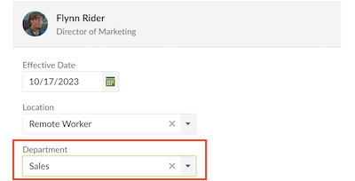
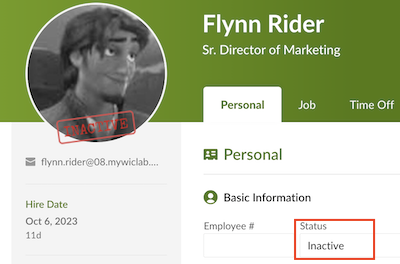
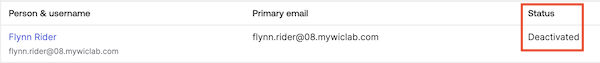

## Navigating Employee Transitions Efficiently

In this lab, you will leverage the dynamic integration of Okta with your HR application. Experience firsthand how a change in an employee's job seamlessly translates into automatic adjustments in their application access. But that's not all - when employees bid adieu to the company, watch as their access is instantaneously disabled. Dive into the world of automation that not only streamlines processes but also ensures consistent security, equipping transitioning employees with the right tools for success and safeguarding company assets every step of the way.

## Employee Transfer

In the Add Job Information dialog, select a different department, and then click Save.

1. Sign in to **BambooHR** with the credentials provided in the Launch Panel.
1. In the BambooHR dashboard search for and select your employee.
1. On the **Job** tab, for **Job Information**, click **Add Entry**.
1. For the **Department**, select **Sales**.
1. Optional. Select a new **Job Title**.
1. Click **Save**.

    

### Import BambooHR changes to Okta

1. In the Okta Admin Console select **Applications > Applications**, and then select **BambooHR**.
1. On the **Import** tab, click **Import Now**.
1. Click **Ok** when the scan completes.
1. In the Okta Admin Console select **Directory > Groups**.
1. Verify that the employee was automatically assigned to the **Sales** group and has access to the new set of Apps.

### Verify changes to Okta End-user Dashboard

In the Virtual Desktop, open a new Chrome window using the Guest profile.

1. Sign in to your Okta tenant as the New Employee.
4. Notice that you no longer have access to **Marketo**, but you do have access to **Salesforce**. Your app assignments changed based on the change in your group membership.

|||
   |:-----|:-----|
   ||*Did you know that Okta's HR application integration streamlines employee job changes, ensuring they have just the right access and preventing a digital pile-up of permissions? It's like a digital wardrobe cleanse, keeping things tidy and just-right for security!*|

## Employee Termination

### Deactivate the employee in the BambooHR tenant

1. In the BambooHR dashboard search for and select your employee.
1. On the **Personal** tab, change the **Status** to **Inactive**.
1. Click **Save Changes**.

    

### Import BambooHR changes to Okta

1. In the Okta Admin Console select **Applications** > **Applications**, and then select **BambooHR**.
1. On the **Import** tab, click **Import Now**.
1. Click **Ok** when the scan completes.

### Verify Employee Status in Okta

1. In the Okta Admin Console select  **Directory** > **People**.
1. Verify that your employee's status is **Deactivated**.

    

1. Open a new browser window that is not signed into Okta.
1. Enter your Okta tenant URL in the browser.
1. Attempt to authenticate as your test user, and you will receive an error due to your deactivated account status.

## Conclusion

In this lab, we've turbocharged our HR game with Okta's dynamic prowess! Every job transition? Seamlessly mirrored in app access. Every farewell? Marked with instant, secure sign-offs. As we've delved into this automation arena, we've seen streamlined processes and top-notch security in action.
