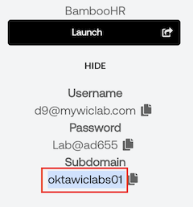

## Old Certification

### Verify the Access Certification Campaign was created

To verify that a certification campaign was created by the flowpack, you will need to perform the following actions as the Okta admin:

1. In the Okta Admin Console select **Identity Governance** > **Access Certifications**.
1. Verify that there is **Campaign** whose name starts with **Title Change:**.
1. Click on the **Title Change:** campaign to see an overview of the campaign.

The page provides an overview of the campaign, the progress of the campaign, and the items to be reviewed. An administrator can use this page to manage the execution of a campaign. They can see the progress and any items still outstanding. They can reassign one or more items. They can also prematurely end the campaign.

>**Note:** Please notify a lab assistant if there is no campaign listed.

## Old FLow

>**Tip:** To view a graphic of the all the cards in a flow, you can select the **Flow Chart** tab while in edit mode.
 .
 Here's a sneak peak. You will be changing cards: **1, 3, 8 and 23**.
 

Set the contents of the first **Compose** card to your Okta tenant URL.
    |||
     |:-----|:-----|
    ||

1. Scroll to the right to locate the next  **Compose** card. It's the eighth card in the flow, and replace the existing login with your Okta admin login.
    |||
     |:-----|:-----|
    ||

1. Scroll to the right and locate the **API Connector Raw Request** card, and then click **Choose Connection**.
1. Set the **Connection** to your **API Connector**.
1. Click **Save**.

    > **Note:** When saving for the first time, select **Save all data that passes through the Flow?**, and then click **Save**.

1. Click **Flow is OFF** and select **Flow is OFF**. The result will be that the **Flow is ON** and **Saving data**.
    |||
     |:-----|:-----|
     ||

## Old O365

>**Tip:** For the next step, you will need the first part of your **Office 365 Tenant** from the lab launch panel.

Be sure to leave off the *onmicrosoft.com* portion.

## Old New Employee

   >**Tip:** Check your **Office 365 Domain Name** in the launch panel; you will need this value for the new employee's email address.
   
    The New Employee's **Work Email** domain needs to match your **Office 365 Domain Name**.

1. The following six attributes are required for your **New Employee**. All other attributes are optional. Use the values for: Job Title, Department and Hire Date. All other fields are optional.

   |Attribute|Value| For Example|
   |:-----|:-----|:----|
   |First Name |Enter a first name|*Flynn*|
   |Last Name | Enter a last name|*Rider*|
   |Work Email |firstName.lastName@\<your Office 365 **Domain Name**>|*<flynn.rider@09.mywiclab.com>*|
   |Hire Date |*Today*|*Today*|
   |Job Title | **Director of Marketing**|*Director of Marketing*|
   |Department | **Marketing**|*Marketing*|

    >**Tip:** Check your **BambooHR Subdomain** in the launch panel; you will need this value for the next step.
    |

## Launch Panel

**Result:**

   |Important step:|Example|
   |:-----|:-----|
   |)| Your **Microsoft Tenant Name** can be found in the lab **Launch Panel**. Ignore the *onmicrosoft.com* portion of the tenant name.|

## Table left-align small images without text

   |||
   |:-----|:-----|
   || |

   |||
   |:-----|:-----|
   || |

### Icon mid sentence

### Sample 1

1. Click **Add integration**.
    >**Tip:** You can find your **Microsoft Tenant Name** in the launch panel.
         
Omit the *onmicrosoft.com* portion of the tenant name.

### Sample 2

1. Click **Add integration**. (double indent, smaller image, IMPORTANT)
      >**IMPORTANT:** You can find your **Microsoft Tenant Name** in the launch panel.
         
Omit the *onmicrosoft.com* portion of the tenant name.

## Tip - no indent - what is pixel width?

>**Tip:** You may want paste your Okta tenant url into Notepad++ for easy copying and pasting in this lab.

## Tip - indent - what is pixel width?

   >**Tip:** You may want paste your Okta tenant url into Notepad++ for easy copying and pasting in this lab.

## Table - Right image

**Result:**

   |Important step:|Example|
   |:-----|:-----|
   |Your **Microsoft Tenant Name** can be found in the lab **Launch Panel**. Ignore the *onmicrosoft.com* portion of the tenant name.||

## Table - Left image

**Result:**

   |Important step:|Example|
   |:-----|:-----|
   || Your **Microsoft Tenant Name** can be found in the lab **Launch Panel**. Ignore the *onmicrosoft.com* portion of the tenant name.|

## No table - indented image

Your **Microsoft Tenant Name** can be found in the lab **Launch Panel**.
Ignore the *onmicrosoft.com* portion of the tenant name.
   

## No table - double indented

**Result:** Outside of a table, images appear to be centered

Your **Microsoft Tenant Name** can be found in the lab **Launch Panel**.
Ignore the *onmicrosoft.com* portion of the tenant name.
      

## Tip

>**Tip:** Your **Microsoft Tenant Name** can be found in the lab **Launch Panel**.
         
Ignore the *onmicrosoft.com* portion of the tenant name.

## Tip with image in table?
>
>**Tip:** Your **Microsoft Tenant Name** can be found in the lab **Launch Panel**.
         
Ignore the *onmicrosoft.com* portion of the tenant name.

## Alerts
>
> [!NOTE]
> Highlights information that users should take into account, even when skimming.

> [!IMPORTANT]
> Crucial information necessary for users to succeed.

> [!WARNING]
> Critical content demanding immediate user attention due to potential risks.

## Supported color models

`#0969DA`
`rgb(9, 105, 218)`
`hsl(212, 92%, 45%)`

## Emoji

You can add emoji to your writing by typing :EMOJICODE:, a colon followed by the name of the emoji.

:+1: This PR looks great - it's ready to merge! :shipit:
:shark_yay:
:wink:
:laughing:
:point_up:
:heart:
:blue_heart:
:green_heart:
:done_2:
:point_left:
:clapping:
:idea:
:smiley:

## github.com/adam-p/markdown-here/wiki/Markdown-Cheatsheet

## Emphasis

Emphasis, aka italics, with *asterisks* or *underscores*.

Strong emphasis, aka bold, with **asterisks** or **underscores**.

Combined emphasis with **asterisks and *underscores***.

Strikethrough uses two tildes. ~~Scratch this.~~

## Lists

1. First ordered list item
2. Another item
⋅⋅* Unordered sub-list.
1. Actual numbers don't matter, just that it's a number
⋅⋅1. Ordered sub-list
4. And another item.

⋅⋅⋅You can have properly indented paragraphs within list items. Notice the blank line above, and the leading spaces (at least one, but we'll use three here to also align the raw Markdown).

⋅⋅⋅To have a line break without a paragraph, you will need to use two trailing spaces.⋅⋅
⋅⋅⋅Note that this line is separate, but within the same paragraph.⋅⋅
⋅⋅⋅(This is contrary to the typical GFM line break behaviour, where trailing spaces are not required.)

* Unordered list can use asterisks

* Or minuses

* Or pluses

## Links

[I'm an inline-style link](https://www.google.com)

[I'm an inline-style link with title](https://www.google.com "Google's Homepage")

[I'm a reference-style link][Arbitrary case-insensitive reference text]

[I'm a relative reference to a repository file](../blob/master/LICENSE)

[You can use numbers for reference-style link definitions][1]

Or leave it empty and use the [link text itself].

URLs and URLs in angle brackets will automatically get turned into links.
<http://www.example.com> or <http://www.example.com> and sometimes
example.com (but not on Github, for example).

Some text to show that the reference links can follow later.

[arbitrary case-insensitive reference text]: https://www.mozilla.org
[1]: http://slashdot.org
[link text itself]: http://www.reddit.com

## Images

Here's our logo (hover to see the title text):

Inline-style:


Reference-style:
![alt text][logo]

[logo]: https://github.com/adam-p/markdown-here/raw/master/src/common/images/icon48.png "Logo Title Text 2"

## Code and Syntax

```javascript
var s = "JavaScript syntax highlighting";
alert(s);
```

```python
s = "Python syntax highlighting"
print s
```

```
No language indicated, so no syntax highlighting. 
But let's throw in a <b>tag</b>.
```

```javascript
exports.onExecutePostLogin = async (event, api) => {
    if(event.organization) {
      api.idToken.setCustomClaim("license", event.organization.metadata.license);
      api.idToken.setCustomClaim("organization", event.organization.display_name);
    }
};
```

## Footnotes

Here is a simple footnote[^1].

A footnote can also have multiple lines[^2].  

You can also use words, to fit your writing style more closely[^note].

[^1]: My reference.
[^2]: Every new line should be prefixed with 2 spaces.  
  This allows you to have a footnote with multiple lines.
[^note]:
    Named footnotes will still render with numbers instead of the text but allow easier identification and linking. [I'm an inline-style link with title](https://www.google.com "Google's Homepage")
    This footnote also has been made with a different syntax using 4 spaces for new lines.

### TABLES

Colons can be used to align columns.

| Tables        | Are           | Cool  |
| ------------- |:-------------:| -----:|
| col 3 is      | right-aligned | $1600 |
| col 2 is      | centered      |   $12 |
| zebra stripes | are neat      |    $1 |

There must be at least 3 dashes separating each header cell.
The outer pipes (|) are optional, and you don't need to make the
raw Markdown line up prettily. You can also use inline Markdown.

Markdown | Less | Pretty
--- | --- | ---
*Still* | `renders` | **nicely**
1 | 2 | 3

## Blockquotes
>
> Blockquotes are very handy in email to emulate reply text.
> This line is part of the same quote.

Quote break.

> This is a very long line that will still be quoted properly when it wraps. Oh boy let's keep writing to make sure this is long enough to actually wrap for everyone. Oh, you can *put* **Markdown** into a blockquote.

### Inline HTML

<dl>
  <dt>Definition list</dt>
  <dd>Is something people use sometimes.</dd>

  <dt>Markdown in HTML</dt>
  <dd>Does *not* work **very** well. Use HTML <em>tags</em>.</dd>
</dl>

### Horizontal Rule

Three or more...

---

Hyphens

***

Asterisks

___

Underscores

## Line Breaks

Here's a line for us to start with.

This line is separated from the one above by two newlines, so it will be a *separate paragraph*.

This line is also a separate paragraph, but...
This line is only separated by a single newline, so it's a separate line in the *same paragraph*.

## Color

$${\color{red}Red}$$
$${\color{red}Hello}$$ $${\color{red}World}$$

$${\color{lightgreen}Light \space Green}$$
$${\color{blue}Your Microsoft Tenant Name can be found in the lab Launch Panel}$$

## Red Apple

RED APPLE (&#x1F34E;)

## Image in a table

1.

 |||
   |:-----|:-----|
   |||
   |r74_584x488||
   |r74_467_390||
   |r74_373_311||
   |r144_1172x336||
   |r144_937x269||

## Image resolution

## Image size

Image tag (r74x373x311)
 

Image tag with width 100
  

  Image tag with width 200
  

  Image tag with width 373
  

## Self Service Solutions

#

|||
   |:-----|:-----|
   |**Note:** There is a single instance of BambooHR for use by all lab participants. When adding new employees, we ask that you use your own name, or those of your favorite alias. **For the work email address, your email domain needs to match your unique Office 365 domain name in the lab launch panel.**||
   |For example, if you were a charming swashbuckler, your work email would be <flynn.rider@04.mywiclab.com>|,

Or, you can review the following tests on image alignment.

# Image size and alignment

1. Image.


2. The above image width x height in pixels is **324 x 406** with resolution of **74**.

3. Next image.

   

4. The above image width x height in pixels is **2074 x 1370** with resolution of 144.
5. More importantly, the image markdown was tabbed in.
6. Below is the same image with no preceeding tab.


7. I also added an image tooltip to the above.
8. Can I put an image in a table?

   |Attribute|Value|
   |:-----|:-----|
   |First Name |**Flynn**|
   |Last Name |**Rider**|
   |Image | |
   || Image|

5. Click **Save**.

6. Images added to a block of text with tooltip

 >**Note:**: There is a single instance of BambooHR for all lab participants.  Use your own name when adding a new employee, as opposed to Flynn Rider.  Also, for the **Work Email** domain, use your Office 365 Domain from the Launch Panel. \
        

7. O365 Domain as a Resolution 74 image ( 584 x 488)

      

8. R 74 image in a hidden table?

   |||
   |:-----|:-----|
   |   |
   |324 x 271||

   |||
   |:-----|:-----|
   |**JZ:** .||

## Test for resolution and size

1. Decent size - 1274 x 576 R 72 - 100%

   

1. Decent Size - 1595 x 496 R 72 100%

   

1. Too big - 1522 x 1034  R144 100%

   

 Was Too big, now R is 72  - 1522 x 1034  R72 100%

   

1. Was Too big, now R is 72, and Width is   - 1522800 x 1034  R72 100%

   

1. Too narrow - 600 x 446 R72

   

## Save the O365 Fastpass Policy

1. Set the following **IF** conditions for the rule:

    | IF | Value|
    |:-----|:-----|
    |User's  type is| Accept the default |
    |User's group membership includes|**At least one of the following groups:**|
    | Enter groups to include: |  **Marketing** and **Sales**|
    |Device State |**Registered**|
    |Device management |**Not Managed**|
    |Client is |**Web Browser** and **Modern Authentication**|'

2. Set the following **THEN** access and authentication settings for the rule:

    |THEN||
    |:-----|:-----|
    |User must authenticate with:| **Possession factor**|
    |Possession factor constraints are|  **Phishing resistant** and **Hardware protected**|
    |If Okta FastPass is used |**The user must approve a prompt in Okta Verify or provide biometrics**|

3. Click **Save**.
8. Using the *vertical waffle*, move the new rule up to the top of the priority list.
