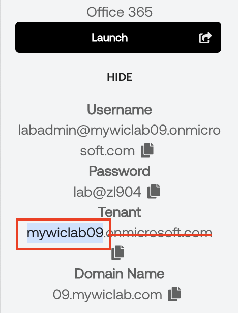
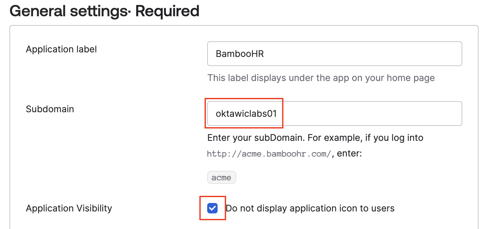
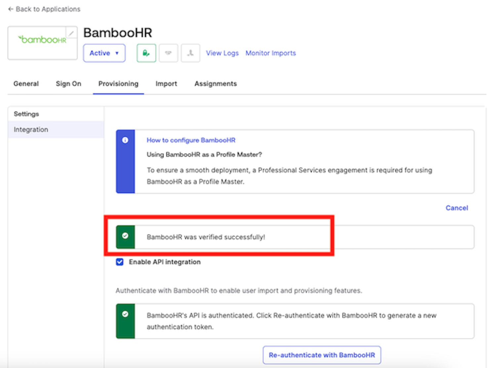

## O365 Launch

   |Important step:|Example|
   |:-----|:-----|
   |Your **Microsoft Tenant Name** can be found in the lab **Launch Panel**. Ignore the *onmicrosoft.com* portion of the tenant name.||

   |Important step:|Example|
   |:-----|:-----|
   |Your **Microsoft Tenant Name** can be found in the lab **Launch Panel**. Ignore the *onmicrosoft.com* portion of the tenant name.||

   |Important step:|Example|
   |:-----|:-----|
   |Your **Microsoft Tenant Name**||

## O365 Launch ( w/o table indented image)

Your **Microsoft Tenant Name** can be found in the lab **Launch Panel**.
Ignore the *onmicrosoft.com* portion of the tenant name.
   

## O365 Launch ( double indented image)

Your **Microsoft Tenant Name** can be found in the lab **Launch Panel**.
Ignore the *onmicrosoft.com* portion of the tenant name.
      

## O365 Launch

>**Tip:** Your **Microsoft Tenant Name** can be found in the lab **Launch Panel**.
         
Ignore the *onmicrosoft.com* portion of the tenant name.

## Color

$${\color{red}Red}$$
$${\color{red}Hello}$$ $${\color{red}World}$$

$${\color{lightgreen}Light \space Green}$$
$${\color{blue}Your Microsoft Tenant Name can be found in the lab Launch Panel}$$

## Red Apple

RED APPLE (&#x1F34E;)

## Image in a table

1.

 |||
   |:-----|:-----|
   |||
   |r74_584x488||
   |r74_467_390||
   |r74_373_311||
   |r144_1172x336||
   |r144_937x269||

## Image resolution

## Image size

Image tag (r74x373x311)
 

Image tag with width 100
  

  Image tag with width 200
  

  Image tag with width 373
  

## Self Service Solutions

#

|||
   |:-----|:-----|
   |**Note:** There is a single instance of BambooHR for use by all lab participants. When adding new employees, we ask that you use your own name, or those of your favorite alias. **For the work email address, your email domain needs to match your unique Office 365 domain name in the lab launch panel.**||
   |For example, if you were a charming swashbuckler, your work email would be <flynn.rider@04.mywiclab.com>|,

Or, you can review the following tests on image alignment.

# Image size and alignment

1. Image.

2. The above image width x height in pixels is **324 x 406** with resolution of **74**.

3. Next image.

   

4. The above image width x height in pixels is **2074 x 1370** with resolution of 144.
5. More importantly, the image markdown was tabbed in.
6. Below is the same image with no preceeding tab.

7. I also added an image tooltip to the above.
8. Can I put an image in a table?

   |Attribute|Value|
   |:-----|:-----|
   |First Name |**Flynn**|
   |Last Name |**Rider**|
   |Image | |
   || Image|

5. Click **Save**.

6. Images added to a block of text with tooltip

 >**Note:**: There is a single instance of BambooHR for all lab participants.  Use your own name when adding a new employee, as opposed to Flynn Rider.  Also, for the **Work Email** domain, use your Office 365 Domain from the Launch Panel. \
        

7. O365 Domain as a Resolution 74 image ( 584 x 488)

      

8. R 74 image in a hidden table?

   |||
   |:-----|:-----|
   |   |
   |324 x 271||

   |||
   |:-----|:-----|
   |**JZ:** .||

## Test for resolution and size

1. Decent size - 1274 x 576 R 72 - 100%

   

1. Decent Size - 1595 x 496 R 72 100%

   

1. Too big - 1522 x 1034  R144 100%

   

 Was Too big, now R is 72  - 1522 x 1034  R72 100%

   

1. Was Too big, now R is 72, and Width is   - 1522800 x 1034  R72 100%

   

1. Too narrow - 600 x 446 R72

   

## Save the O365 Fastpass Policy

1. Set the following **IF** conditions for the rule:

    | IF | Value|
    |:-----|:-----|
    |User's  type is| Accept the default |
    |User's group membership includes|**At least one of the following groups:**|
    | Enter groups to include: |  **Marketing** and **Sales**|
    |Device State |**Registered**|
    |Device management |**Not Managed**|
    |Client is |**Web Browser** and **Modern Authentication**|'

2. Set the following **THEN** access and authentication settings for the rule:

    |THEN||
    |:-----|:-----|
    |User must authenticate with:| **Possession factor**|
    |Possession factor constraints are|  **Phishing resistant** and **Hardware protected**|
    |If Okta FastPass is used |**The user must approve a prompt in Okta Verify or provide biometrics**|

3. Click **Save**.
8. Using the *vertical waffle*, move the new rule up to the top of the priority list.
